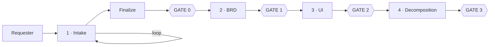
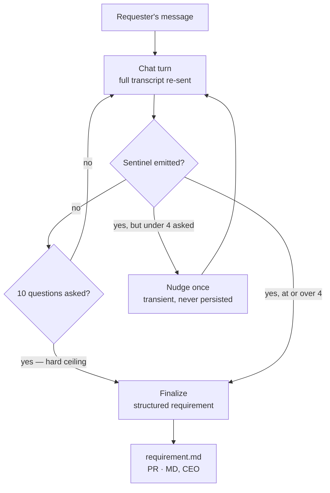
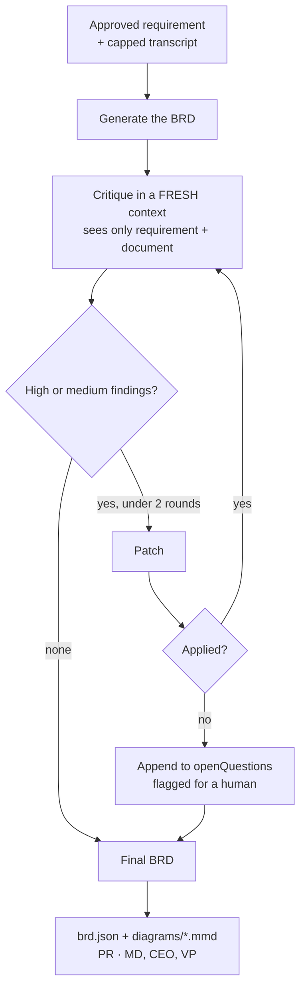
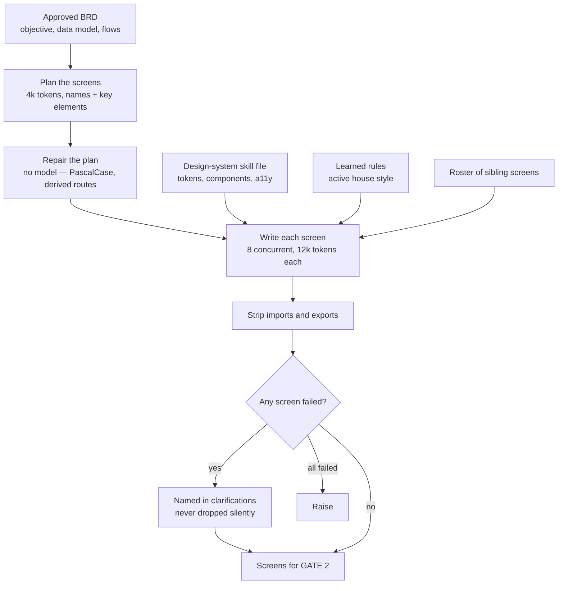
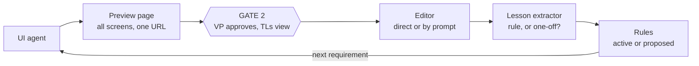
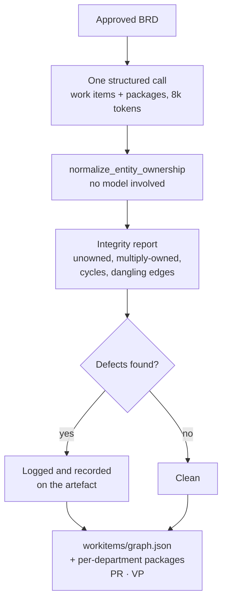

# Agents — Specification and Internal Flows

**Companion to:** [architecture.md](architecture.md) — system shape, gates, Git integration, model configuration.
**Scope:** Agents 1–4 (Intake → BRD → UI → Decomposition). Agents 5–8 (Code, Review, Test, Remediation) exist in the Express backend as `runCodeGen`, `runCodeReview`, `runSecurityAutoFix` and `runBuildFix`, and are out of scope per [architecture.md §13](architecture.md#13-explicitly-out-of-scope).

Every agent below is a deterministic node: fixed sequence, forced output schema, no autonomous tool selection. The repair steps in each diagram exist because a prompt alone was insufficient — each one traces to an observed failure, named in the section that follows it.

Which model runs each agent is a deployment setting, not a constant. See [architecture.md §8](architecture.md#8-model-configuration); the defaults given below are the environment's.

---

## Pipeline position

All four agents are nodes on one compiled LangGraph (`app/pipeline_graph.py`), checkpointed to Mongo per requirement so each gate is a real resumable pause. See [architecture.md §2.2](architecture.md#22-what-langgraph-actually-runs-).

---

## 1. Intake agent

**Role.** Converts a plain-language business request into a complete, unambiguous requirement through guided conversation.

**Satisfies.** Proposal §2.1, D2 · SoW 9.0

| | |
|---|---|
| **Input** | Originator tier, conversation history |
| **Output** | Refined transcript, then a structured requirement document |
| **Gate it feeds** | Gate 0 / GATE 1 |
| **Implementation** | `run_chat_turn`, `finalize_requirement`, `intake_agent` |
| **Default models** | `claude-haiku-4.5` for turns, `gpt-4o-mini` for structuring |

**Function.** Asks one question per turn against a five-item coverage checklist: primary users and core flow; net-new versus integration; data sensitivity and scale; in-product AI features; and preferred code-generation model. It never asks two checklist items separately when one question can cover both.

**Bounded loop.** A floor of 4 questions and a ceiling of 10, both enforced in code rather than by prompt. The ceiling matters for cost, not just experience: every turn re-sends the entire transcript, so token spend grows with the *square* of conversation length. A measured 41-turn conversation consumed ~95,000 input tokens against ~12,700 for the same intake held to ten — roughly 7.5× for 4× the turns. Returning before building the request also means the turn that would have blown the budget costs nothing at all.

**Termination.** Emits a sentinel once all five checklist items have broad-strokes answers, or terminates unconditionally at the ceiling. An explicit request to stop from the requester overrides the floor.

**Failure mode addressed.** The sentinel was previously matched by exact string equality against the whole reply. When the model wrapped it in a sentence the match failed silently and the conversation ran 30 further turns of pleasantries. Detection is now a whole-word match anywhere in the reply.

---

## 2. BRD agent

**Role.** Expands an approved requirement into a production-ready BRD an engineering team could build from directly.

**Satisfies.** Proposal §2.2, D2 · SoW 9.0, 10.0

| | |
|---|---|
| **Input** | Approved requirement summary, intake transcript capped at 30 messages |
| **Output** | Objective, architecture, architecture diagram, tech stack, user flow, data model, ER diagram, page behaviour, security design, deployment/operations, timeline, assumptions, open questions |
| **Gate it feeds** | GATE 1 |
| **Implementation** | `brd_agent` → `_generate`, `_critique`, `_patch` |
| **Default model** | `deepseek-v3.2` |

**Function.** Produces every field concretely — named entities, real pages, specific technologies. Each tech-stack choice must state why it fits, the leading alternative considered and why it was rejected, and the main limitation of the choice in this operating environment.

**The critique runs in a fresh context.** The reviewer sees only the requirement and the finished document, never the reasoning that produced it. It judges fitness for purpose: will each component work under the real operating conditions; does a governing industry standard already exist that the design ignored; is every promised capability genuinely delivered; does the data model claim fields the chosen components cannot produce; and is failure/safe-state behaviour defined where the build touches physical systems, money or regulated data.

**Why the fresh context matters.** Asking the same model to be more careful during generation did not work; reviewing the artefact cold did. On a real BRD this found four defects independently, including a data-model field the chosen hardware could not physically produce, and a missing safe-state definition for a public venue.

**Bounded to 2 rounds with plateau detection.** If the rewrite cannot be applied, unresolved findings are appended to `openQuestions` rather than discarded — a failed auto-fix degrades to "flagged for a human", never to silence.

---

## 3. UI agent

**Role.** Generates the application interface from the approved BRD, before any code is written.

**Satisfies.** SoW 11.0, 12.0 · SoW 2.0 (Phase 1)

| | |
|---|---|
| **Input** | Approved BRD, design-system skill file, active learned rules |
| **Output** | Self-contained React screens plus clarifications |
| **Gate it feeds** | GATE 2 |
| **Implementation** | `ui_agent` → `_plan_screens`, `_fill_blanks`, `_write_screen`, `strip_module_syntax` |
| **Default models** | `deepseek-v3.2` to plan, `qwen3-coder` to write |

**Two models on purpose.** Planning is a schema-following task; writing is a coding one. Two models have failed the plan while handling their own stage fine.

**Planned first, then one call per screen.** The original single call asked for every screen's source at once under a 14,000-token ceiling. A nine-page BRD produces ~44,000 tokens of React — three times the budget — so the JSON truncated mid-string and failed as a parse error rather than a short answer, losing the entire design rather than the last screen. Each screen now gets 12,000 tokens of its own, eight running concurrently. Each is told the others' names and routes, so cross-screen navigation resolves to something that was actually generated.

**The repair step is not optional.** Every plan field but `name` is optional in the schema, because requiring them lost whole plans to a 400. That trade means a model can legitimately return names and nothing else — `gpt-oss-120b` returns exactly that — so routes are derived in code. Names are forced to PascalCase because the name becomes a JavaScript identifier: models return "Leave Request" despite being asked for PascalCase, and an invalid identifier means the screen is silently dropped from the preview it was generated for.

**Stripping module syntax is the fix that stuck.** A screen arrives as a real file would — `import React from 'react'` at the top, sometimes `export default` at the bottom. The prompt says not to, and a code-specialised model does it anyway: every one of eleven screens failed with "Cannot use import statement outside a module" while the React itself was clean. Instructing harder is the losing move; these models are trained on files that always have imports.

**Failures are isolated.** `_write_screen` returns `None` rather than raising, so one bad screen costs one screen and the rest still reach the reviewer — listed by name as a clarification. Only if every screen fails does the agent raise.

**Position is the point, and the gate blocks.** SoW 12.0 states *"code generation for the affected scope cannot start until UI approval is recorded."* The JavaScript pipeline inverted this — its nearest artefact was produced *by* code generation. The Python pipeline runs the agent in the correct position, and the decomposition does not run until the VP approves: `uiApprovedAt` releases it, and until then "Generate TL packages" is withheld. Generating the split regardless would have made the approval decorative, since the packages a team lead executes against would already exist, scoped to an interface nobody had signed off.

Editing a screen withdraws that approval. The VP signed off the screens as they were, and carrying the approval silently onto changed source is the thing the gate exists to prevent.

**Not a new stage, deliberately.** The gate lives on the artifact (`uiApprovedAt`, `uiApprovedBy`) rather than in `currentStage`. The FSD chain's stages decide who signs off the requirement and its FSD; the screens are a separate object with a separate reviewer, and threading them through the chain would change what every existing stage means — including `approved`, which code generation keys off.

**Reviewer.** VP. SoW 11.0 names "UI/UX and Business Analysts", but no such tier exists — the tiers are md, ceo, vp, pm and tl. VP is the closest existing authority and is what the code, CODEOWNERS and webhook all use. Introducing dedicated reviewer roles would be a hierarchy change to agree with the client.

**Constrained by a skill file, per SoW 11.0.** The design system — styling mechanism, colour tokens, spacing, components and accessibility rules — is a stored, versioned artefact rather than prose in the prompt. It is read once per generation, injected into every screen's system prompt and into the screen editor, and committed to Git as `ui/design-system.skill.md` beside the screens it governed, so a reviewer approving those screens can read the exact rules they were written against even after the stored file moves on. Editable by MD, CEO or VP; every save keeps the previous text as a revision with the editor's identity, which is what SoW 4.0 requires of a skill file.

It also settles a question that used to have two different answers. The skill file mandates Tailwind utility classes, and the preview loads Tailwind — previously the models chose Tailwind on their own initiative while the preview loaded no CSS, so ten of fourteen screens on a real requirement rendered as unstyled HTML while the pipeline reported success.

**Known gap.** ❌ Nothing verifies a screen compiles or renders before it reaches GATE 2 — a screen that parses as JSON and fails at runtime is published as if it worked. One of the fourteen WorkPulse screens (`AuditTrail`) is in exactly that state. This is the subject of the JSX-compile CI check in [architecture.md §10](architecture.md#10-ci-checks-).

### 3.1 The review and learning loop

TLs can view the screens once their package exists; only a VP can approve. Edits happen on the page itself rather than in a modal, by direct manipulation or by instructing the agent. Every edit is then judged for whether it generalises — see [architecture.md §9](architecture.md#9-the-learning-loop) for the rule-versus-edit distinction and the risks it carries.

**Note on document conflict.** Proposal §7 lists "UI prototype generation" as a roadmap item, and §11 excludes everything in §7. The SoW response reconciles this by distinguishing **working React screens (Phase 1)** from a **Figma round-trip (add-on)**. Worth confirming with the client.

---

## 4. Decomposition agent

**Role.** Breaks an approved BRD into scoped work items and department packages ready for independent execution.

**Satisfies.** Proposal §2.3, D3

| | |
|---|---|
| **Input** | Approved BRD, after approved UI |
| **Output** | Work items with dependency edges and owning department; per-department packages carrying objective, architecture, tech stack, phased plan, data model with ownership flags, and dependencies |
| **Gates it feeds** | GATE 3 (VP approves the graph), GATE 4 (each TL approves their slice) |
| **Implementation** | `decomposition_agent` + `invariants.normalize_entity_ownership` |
| **Default model** | `gpt-4o` |

**Function.** Assigns work across the five departments — QA, AI, Development, DevOps, Sales & Marketing — skipping any with nothing to do. Each package is an execution-focused mini-BRD.

**The integration contract.** Departments generate code independently and never see each other's output, so the package is the *only* thing keeping the finished modules compatible. Three invariants:

1. **Shared entities are described identically everywhere** — same name, same field names, character for character, copied verbatim from the BRD.
2. **Entities a department only reads are still included**, flagged as not owned, so it references rather than reinventing them.
3. **Exactly one department owns each entity** — never zero, never two.

**Failure mode addressed.** Before the data model was carried into packages, one department created a table `Return_Items` while another wrote a foreign key against `ReturnItems` — a combination that cannot build.

**Deterministic repair.** `normalize_entity_ownership` runs after every split. Unowned entities are assigned, preferring Development, which owns the core application; double-claimed entities are demoted to a single owner. This exists because the prompt alone was insufficient — a real split marked four entities read-only in all five packages, meaning no department would have generated their schema.

**Integrity is detected but does not block.** ⚠️ Cycles, dangling dependencies and ownership defects are computed after every split and stored on the artefact under `integrity`, and logged as errors. Nothing stops the package publishing. The current WorkPulse split carries **11 dangling dependency edges** pointing at a work item that does not exist — detected, recorded, and shipped to the graph that feeds code generation. Making this a blocking CI check is [architecture.md §10](architecture.md#10-ci-checks-).

---

## 5. Gate summary

| Gate | Approver | Object | Status |
|---|---|---|---|
| GATE 0/1 | Per approval chain | Requirement, then BRD | ✅ Built |
| GATE 2 | VP | UI screens | ✅ Built — approval releases the decomposition |
| GATE 3 | VP | Work-item graph | ⚠️ PR opens and is reviewable; nothing waits for it |
| GATE 4 | Owning TL | Department slice | ⚠️ TLs can edit and request revision; no approve-before-codegen block |

Requirement-flow diagrams by originator, and the approval-chain table, are in [architecture.md §3](architecture.md#3-the-pipeline). They live there because they describe routing, an architecture concern, while this document specifies agent behaviour.
