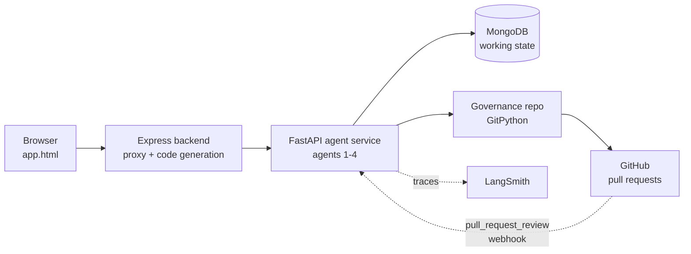
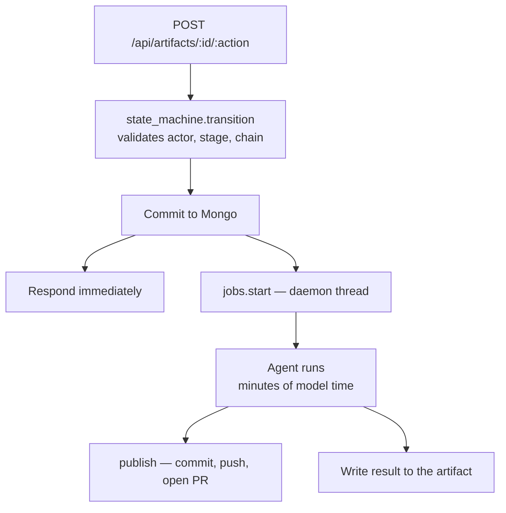
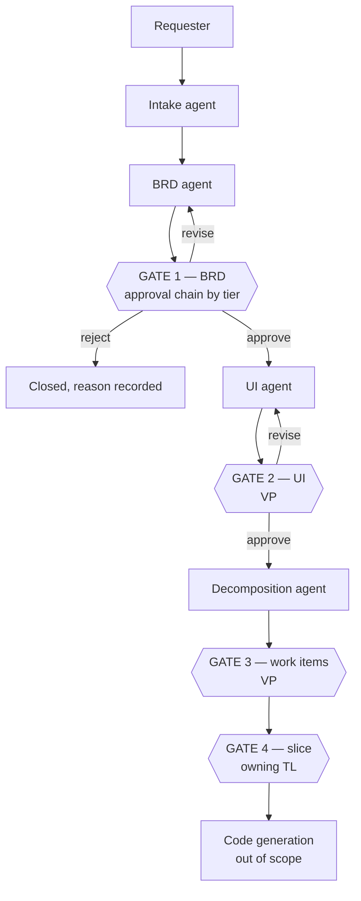
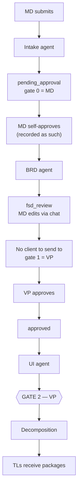
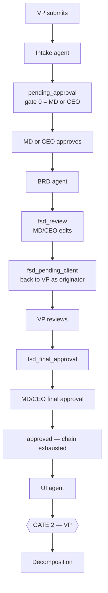
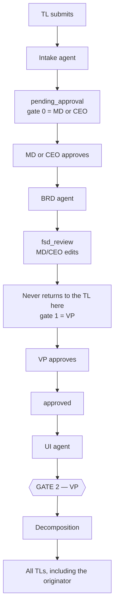
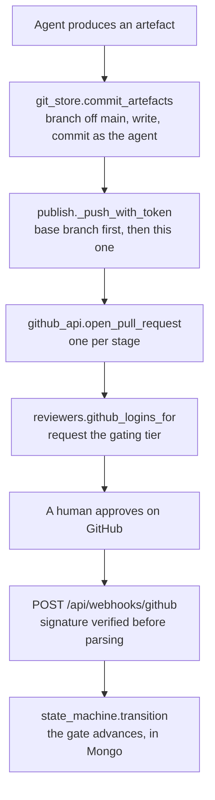
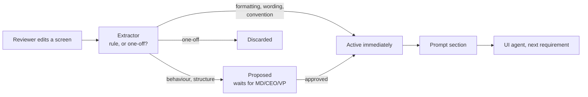

# Architecture — Intake to Decomposition

**Status:** Built and running. Sections marked ⚠️ or ❌ describe what is specified but not yet true.
**Scope:** Agents 1–4 (Intake → BRD → UI → Decomposition), the departmental governance model, and Git as the artefact backbone. Code generation onward is out of scope (§13).
**Source documents:** *AI-Enabled Software Factory — Solution Proposal v1.0* (July 2026) and *Scope of Work for AI enabled SDLC using DevSecOps with GitHub*.
**Companion:** [agents.md](agents.md) — per-agent behaviour and internal loops.

Throughout, **Proposal §n / Dn** refers to the Solution Proposal, and **SoW n.0** to the numbered rows of the Scope of Work.

Git integration was previously a separate document. It is now §6 of this one, because the repository layout, the branch model and the gate mechanics are not a subsystem bolted onto the architecture — they *are* the governance record the architecture exists to produce.

---

## 1. What this system is

A plain-language business request goes in; a reviewed BRD, an approved set of screens, and a departmental work-item split come out, with every artefact and every approval recorded in Git.

Two commitments shape everything below:

- **Agent orchestration** (SoW 5.0, 8.0) — the pipeline is four agents with typed state and human gates between them, not a script calling models.
- **Git as the system of record** (SoW 4.0) — "Requirements, BRDs, designs, prompts, skill files and code are all version-controlled in Git."

Several commitments that look independent are consequences of the second. BRD versioning (SoW 10.0), prompt-template versioning with approver identity (SoW 4.0), and the four missing audit-trail fields (SoW 7.0) were all committed to be delivered *via Git*. They are one layer, not several tasks.

A note on interpretation: agents 1–4 produce documents rather than code, so "CI/CD" at this stage means Git and GitHub Actions acting on artefacts — validation checks and PR-based approval gates — rather than build and deploy pipelines.

---

## 2. System shape



| Component | Holds | Language |
|---|---|---|
| `frontend/` | The workspace UI, screen editor, settings | Static HTML/JS |
| `backend/` | Session proxy, code generation (agents 5–8) | Express |
| `agent-service/` | Agents 1–4, gates, git publishing | FastAPI + Python |
| MongoDB `ai_factory` | Artifacts, users, settings, lessons, jobs | — |
| Governance repo | Every artefact, every gate as a pull request | Git |

**The state split is deliberate.** Mongo holds *working state* — which stage a requirement is in, who has approved so far, what the current draft says. It is mutable by design, and an approval that changes a document in place leaves no evidence of what was approved. Git holds *the record*.

| Question | Answered by |
|---|---|
| What is this requirement's state right now? | Mongo |
| Who is this waiting on? | Mongo |
| What exactly did the VP approve, and when? | Git |
| Which agent produced this, and from what? | Git |

SoW 18.0 anticipates exactly this split: "Single source of record in Git plus the workspace."

### 2.1 How a request actually executes



**Generation never runs inside the approving request.** It used to, and produced two distinct failures on a real requirement: the proxy gave up at 300s and returned 502 while the server carried on and finished — the approver saw an error over work that had succeeded, and the obvious reaction, approve again, was exactly wrong. Worse, generation errors were returned in the response body and nowhere else, so a discarded response left the artifact at `approved` with no BRD, no screens and no record of why.

A job is now a document in Mongo, not a value in a response. It carries the process id that started it, so a job still marked `running` under a different process is provably dead and is reaped as `interrupted` at startup rather than waiting forever.

### 2.2 What LangGraph actually runs ✅

`app/pipeline_graph.py` is a compiled `StateGraph` that **executes**, and all four agents run on it. It owns which agent runs next and what state carries between them — checkpointed to Mongo (`graphCheckpoints`, `graphCheckpointWrites`) with `thread_id` set to the artifact id, so a gate is a genuine resumable pause rather than a condition re-derived from Mongo on the next request.

```
intake ⏸(loop) → finalize → gate_requirement ⏸
  → brd → gate_brd ⏸ → ui → gate_ui ⏸ → workitems → END
```

Neither the chat route nor `_run_generation` decides what happens next any more; both ask the graph to advance.

**Intake is a loop, and `interrupt()` is the node's first statement.** A resumed node re-runs from the top, so a model call placed above the interrupt would fire twice per message — billing double and appending the reply twice. Taking the message first means everything below it runs exactly once per turn.

**What the graph deliberately does not own.** Approvals, stage transitions and who may act stay in `state_machine.py`; git publishing and artifact persistence stay in the routes. That is the division in §5 — git operations and human gates are explicitly not agents and must stay deterministic. The graph decides *what generates*; the state machine decides *what is permitted*.

**Why the gates are opaque.** The graph pauses without knowing which of the eight stages the pause corresponds to. The real workflow's FSD review loop (`fsd_review` → `fsd_pending_client` → `fsd_final_approval`) is the state machine's business, and modelling it in both places would create two implementations of the approval rules that could disagree.

**The transcript is not duplicated.** The intake node reads the conversation from the artifact rather than accumulating it in graph state, and the route writes each message back. Holding it in both places would put the same data under two authorities that can disagree — and the workspace renders from Mongo, so a checkpoint that drifted would make the UI lie about what was said. The checkpoint holds position, not content.

**Mongo stays authoritative.** The checkpoint is an accelerator. A thread that is missing, stale, or parked at the wrong phase falls back to running the node directly against the artifact — the same node functions, so behaviour cannot drift; what is skipped is checkpointing, not the work. If the checkpointer cannot be constructed at all, generation degrades to unresumable rather than failing: `MongoDBSaver` builds indexes on construction and so needs privileges the rest of the service does not, and a missing optimisation must not become an outage of the pipeline's main job.

**There is one graph, and it is the one that runs.** An earlier `app/graph.py` declared the whole pipeline — including the approval gates — and executed none of it, reachable only through `langgraph.json` while a hand-written chain did the real sequencing. It has been deleted rather than left as a second, more impressive-looking drawing for a reader to find first. `langgraph.json` exposes `generation` and nothing else.

---

## 3. The pipeline



Rejection at GATE 1 closes the request with the reason recorded and the audit trail retained (SoW 10.0). Rejection at any later gate returns the artefact to its producing agent.

### 3.1 Gate status

| Gate | Approver | Object | Status |
|---|---|---|---|
| GATE 0/1 | Per approval chain | Requirement, then BRD | ✅ Built |
| GATE 2 | VP | UI screens | ✅ Built — approval releases the decomposition |
| GATE 3 | VP | Work-item graph | ⚠️ PR opens and is reviewable, but nothing waits for it |
| GATE 4 | Owning TL | Department slice | ⚠️ TLs can edit and request revision; no approve-before-codegen block |

`/codegen/start` enforces `currentStage === 'approved'` **and** `uiApprovedAt` — SoW 12.0's *"code generation for the affected scope cannot start until UI approval is recorded"*, checked on the action the sentence names rather than inherited from the decomposition. What it still does not verify is that the decomposition itself was reviewed — GATE 3 remains advisory.

That check needed a schema change to work at all. `ui` and `uiApprovedAt` are written by the Python service and were undeclared on the Express `Artifact` model, and under Mongoose's default strict mode an undeclared path does not hydrate: `artifact.ui` read back as `undefined` on a document whose `_doc.ui` held fourteen screens. A gate reading `undefined` never fires, so the fields are now declared as `Mixed` — the same fix, and the same reasoning, as the note already on `teamReports`.

### 3.2 Approval chains

The chain is keyed on originator tier, resolved once at entry from `config.APPROVAL_RULES`:

| Originator | Chain |
|---|---|
| MD | `[md]` → `[vp]` |
| CEO | `[ceo]` → `[vp]` |
| **VP** | `[md, ceo]` — single gate |
| PM | `[md, ceo, vp]` — single gate |
| TL | `[md, ceo]` → `[vp]` |
| Client | `[md, ceo]` → `[vp]` |

A VP cannot approve their own requirement — VP-originated work escalates upward and has no VP gate at all.

Only GATE 1 consumes a step of this chain. GATE 2 and GATE 3 have fixed approvers and do not advance it.

### 3.3 Stage transitions

The FSD review loop is a separate set of stages from the approval gate, and the same GitHub approval means different things in each:

| Stage | Permitted actions |
|---|---|
| `draft`, `clarifying`, `revision_requested` | `submit` |
| `pending_approval` | `approve`, `reject`, `requestRevision`, `proposeChanges` |
| `pending_client_review` | `acceptChanges` |
| `fsd_review` | `sendFsdToClient` |
| `fsd_pending_client` | `approveFsd` |
| `fsd_final_approval` | `giveFinalFsdApproval` |

Only `pending_approval` models rejection and revision; the FSD loop has no equivalent transition, so those decisions are recorded but cannot move it.

**Generation is gated on the action, not the transition.** Submitting a requirement must not publish a BRD — an early port dropped that guard and produced documents before anybody approved anything.

### 3.4 Requirement flows by originator

The three originator paths differ because the chain differs. All three now include GATE 2, which blocks the split.

#### MD-originated



**Governance note.** MD approves at gate 0 on their own artefact. SoW 6.0 commits that *"a requester cannot approve their own artefact"*. An independent VP gate still follows and the MD/CEO peer-bypass was removed, but this remains an open decision (§12).

#### VP-originated



**Governance note.** The cleanest segregation of duties of the three — the originator never approves their own gate, and the FSD returns to them as the requesting party rather than as an approver.

#### TL-originated



**Governance note.** A TL-originated requirement deliberately skips the client-review loop: TL requirements move from the MD/CEO FSD review to the VP gate and do not return to the originating TL until VP releases the generated packages.

---

## 4. Reconciliations

The two source documents and the build disagree in three places. Each is resolved deliberately.

### 4.1 Departments vs dependency-ordered work items ⚠️

Proposal §2.3 and D3 specify "scoped, dependency-ordered work items". Neither document mentions departments or team leads. The build decomposes into five fixed departments — QA, AI, Development, DevOps, Sales & Marketing — a structure deriving from Stark Digital's own delivery pod in Proposal §9, which describes engagement staffing, not a decomposition model.

**Resolution — two-level decomposition.** The agent emits work items carrying a real dependency graph *and* an owning department. The graph satisfies D3; departmental ownership and TL approval survive.

This is stronger than either model alone: five independent department packages do not naturally cohere, which is why entity-ownership repair is required after every split. **Partially built** — work items and edges are emitted, but the graph currently contains 11 dangling edges pointing at a non-existent item, so it is not yet trustworthy as an ordering.

### 4.2 Analyst gate vs TL gates

D3 requires an analyst review gate before code generation; the build has TLs approving their own packages and no gate on the decomposition itself.

**Resolution — keep both as distinct gates.** VP approves the graph as a whole (GATE 3), then each TL approves their slice (GATE 4).

### 4.3 UI stage position ✅

**The UI stage is a SoW commitment, verified against the signed document.** The two rows are quoted here in full because the Proposal appears to contradict them, and anyone reading only the Proposal will conclude this work is out of scope.

**SoW 11.0 — UI Design.** Specification: *"After BRD approval, AI generates the application UI, which is reviewed by UI/UX and Business Analysts. AI seeks clarification when needed, and all design versions are version-controlled and tracked."* Stark Digital's response: *"AI generates the application UI as working React screens constrained by a Jakson design-system skill file (tokens, components, accessibility rules), rendered in a preview environment for UI/UX and BA review. The agent raises clarification requests where the BRD is ambiguous. All versions are held in Git."*

**SoW 12.0 — UI Approval.** Specification: *"Business stakeholders review and approve the UI through a system-based workflow. If changes are required, they are managed through system, after which the design is revised and resubmitted for approval. Development proceeds only after all approvals are completed."* Response: *"System-based UI approval workflow with change requests captured, revisions regenerated and resubmitted. The pipeline is hard-gated: code generation for the affected scope cannot start until UI approval is recorded."*

Reinforced elsewhere in the same document: **SoW 2.0** names "UI UX creation & approval" as a stage of the end-to-end flow and commits the React screens to **Phase 1** (only a Figma round-trip is an add-on); **SoW 3.0** puts "UI UX finalization" in the workspace; **SoW 6.0** lists UI among the approval gates; **SoW 18.0** makes "approved UI" a mandatory release gate.

**Built.** The UI agent runs after BRD approval and before decomposition, and `uiApprovedAt` releases the split. Until then "Generate TL packages" is withheld.

**Reconciling the Proposal.** The Solution Proposal has no UI stage — no UI layer in its §6 architecture, no UI deliverable in D1–D11, and §7 lists "UI prototype generation" as a roadmap item that §11 then excludes until individually scoped. The SoW is the later and more specific document, and it resolves this itself at 2.0: working React screens are Phase 1; the *Figma round-trip* is the add-on. The Proposal's §11 exclusion of "polished UI/UX design or prototyping — the platform generates functional interfaces, not design prototypes" is consistent with that reading, and with what this agent produces.

Ordering note: each document omits what the other includes. Proposal §2 sequences BRD → decomposition → code and never mentions UI. SoW sequences BRD → UI → approval → code and never mentions decomposition. UI-before-decomposition is a judgement call, taken because the UI is application-wide while work items are slices of it.

---

## 5. Agents

| # | Agent | Responsibility | Internal loop |
|---|-------|----------------|---------------|
| 1 | **Intake** | Multi-turn refinement until the requirement is unambiguous | Bounded question budget, 4–10 |
| 2 | **BRD** | Produce the structured BRD | Critique in a fresh context → patch |
| 3 | **UI** | Generate React screens from the approved BRD | Plan → one call per screen → clarifications |
| 4 | **Decomposition** | Work items, dependency edges, department packages | Deterministic ownership repair |

Behaviour, prompts and failure modes are specified in [agents.md](agents.md), with a diagram per agent.

Agents are graph nodes with typed state, kept **deterministic**: fixed sequence, forced tool schemas, no autonomous tool selection. The framework supplies checkpointing, retries, streaming and tracing; it does not supply model autonomy.

This is a deliberate choice. Repeated failures in this pipeline stem from models not reliably following instructions, and every verify-then-repair mechanism in the codebase exists because a prompt alone was insufficient. Widening model discretion would amplify that failure mode.

**Deliberately not agents:** security scanners, CI execution, deployment, Git operations, audit logging, and all human gates. These are deterministic and must stay so. The most serious defect found to date was a security scanner silently scanning an empty directory while reporting success — no AI layer above it noticed, because the AI layer was never the thing being trusted.

---

## 6. Git as the system of record

Git is not storage bolted onto the pipeline. Every agent output is a commit authored by that agent; every approval gate is a pull request.

One consequence worth stating plainly: **the pipeline runs without Git configured.** `open_store()` returns `None` when `GOVERNANCE_REPO_PATH` is unset and publishing becomes silently inert. That is deliberate — the migration should not require every deployment to have a repository before anything works — but an unconfigured environment produces no audit trail while looking healthy.

### 6.1 End-to-end path



Everything above the human decision is the pipeline publishing; everything below is a decision travelling back. The halves are deliberately separate: publishing is best-effort and never blocks an approval, while an approval arriving by webhook is re-authorised from scratch rather than trusted because GitHub let it through.

### 6.2 Repository layout — one folder per requirement

One governance monorepo, not a repository per requirement. Repository-per-requirement would need org-level creation rights, accumulate one repository per requirement indefinitely, demand CODEOWNERS and branch protection on each, and make cross-requirement search impractical.

There is a genuine case for a separate repository for **generated application code**, which needs its own CI, release history and deployment. That belongs to the code agent, out of scope here — so that decision is deferred, not taken.

```
ai-factory-requirements/
├── prompts/                                versioned prompt templates (SoW 4.0)
└── requirements/<slug>/
    ├── requirement.md                      agent 1 — transcript + structured summary
    ├── brd/brd.json                        agent 2
    ├── brd/diagrams/*.mmd                  architecture and ER diagrams, split out
    ├── ui/screens/*.jsx                    agent 3 — one file per screen
    ├── ui/preview.html                     the screens assembled into one runnable page
    ├── ui/clarifications.md                what the UI agent could not resolve alone
    ├── workitems/graph.json                agent 4 — work items + edges
    └── workitems/<dept>/package.json       one per department
```

**The slug is readable and stable.** `req/6a968da2ee951e14aa09ae1a/brd` identifies nothing in a branch list, so the folder pairs the title with a short id suffix: `starklogix-warehouse-and-logistics-6a968da2`. It is computed once and stored on the artifact as `repoSlug`, never recomputed — the FSD edit chat can rename a requirement mid-pipeline, and a folder that moved with the title would strand every artefact already committed under the old name.

**Diagrams are separate files.** A Mermaid diagram inside a JSON blob cannot be linted, diffed or previewed; as `.mmd` files GitHub renders them in the pull request.

**The requirement is Markdown, not JSON.** It is the artefact a human actually reads at the first gate. The structured form is embedded for machines.

### 6.3 Branches — one per stage within that folder

```
main
req/<slug>/requirement
req/<slug>/brd
req/<slug>/ui
req/<slug>/workitems
```

One folder per requirement; four branches into it, one per gate. Each branches **from `main`**, not from the previous stage, so a reviewer opening the BRD's pull request sees only the BRD — not the requirement, the screens, and everything else since.

The cost is a common confusion: browsing the `requirement` branch and navigating to `brd/` gives a 404, because that folder exists only on the `brd` branch. The branch selector is the answer.

**A stage commit is a snapshot, not an append log.** The folder is cleared before writing, and staging uses `git add --all` over the requirement path rather than `index.add`, which records additions only. Without both, regenerating left every earlier attempt in place — one UI branch accumulated 32 screen files across five runs, including the same screen under two slugs after its name was normalised, with no way to tell which was current.

### 6.4 Reviewers and enforcement

Each agent commits **once, on completion** — never mid-run. A partially generated BRD is not a reviewable artefact. Individual intake turns are deliberately not committed (up to ten noise commits per requirement); intermediate BRD critique rounds likewise, since only the final patched document is something anyone approved.

| Stage | Commit author | Reviewing tiers | Gate |
|---|---|---|---|
| `requirement` | `intake-agent[bot]` | MD, CEO | Gate 0 |
| `brd` | `brd-agent[bot]` | MD, CEO, VP | GATE 1 |
| `ui` | `ui-agent[bot]` | VP | GATE 2 |
| `workitems` | `decomposition-agent[bot]` | VP | GATE 3 |

`git log` therefore attributes each artefact to the agent that produced it, rather than to "the service". An unknown agent name is refused rather than defaulted, so a new agent cannot commit anonymously by omission.

Two mechanisms resolve tiers to accounts, because only one works everywhere.

**Teams** (`@org/tier-vp`) are what the SoW commits to. They drive CODEOWNERS and branch protection, so enforcement lives in the repository rather than in application code, and GitHub's own rule that an author cannot approve their own pull request gives segregation of duties for free:

```
/requirements/*/requirement.md          @org/tier-md @org/tier-ceo
/requirements/*/brd/                    @org/tier-md @org/tier-ceo @org/tier-vp
/requirements/*/ui/                     @org/tier-vp
/requirements/*/workitems/graph.json    @org/tier-vp
/requirements/*/workitems/<dept>/       @org/tl-<dept>
/prompts/                               @org/tier-vp
```

**Individual users** are the fallback. Teams require a GitHub *organisation*; on a personal account no team can exist, and requesting one silently reviews nothing. Naming humans directly still puts the right people on the pull request — it just cannot be *enforced* by branch protection. Falling back is deliberate: a gate nobody is asked to review is worse than one enforced only by convention, because the first looks fine and quietly waits forever.

The internal-user-to-GitHub-account mapping lives on the user record as `githubLogin`, managed through `/api/admin/github-mappings` and restricted to MD and CEO — it decides whose GitHub approval can move a requirement through a gate, so it is an authority change, not a profile setting. `GET` on that endpoint reports `blocked_stages`: gates that cannot advance because no approver has an account mapped.

**One limitation to design around.** GitHub reviews are unordered: branch protection can require a CODEOWNERS approval but cannot express *"gate 0 = MD, then gate 1 = VP"*. Approval chains are sequential. The division is therefore: **GitHub enforces who may approve; the pipeline enforces the order.**

### 6.5 Approvals coming back

A pull request review is a governance decision, so the webhook carries real authority. Two rules follow.

**Verify before parsing.** The HMAC-SHA256 signature is checked against the raw body before anything in the payload is trusted, and a missing secret fails closed. The rejection is deliberately terse — a detailed reason would help someone probe for a valid signature.

**Re-check the reviewer's authority.** The reviewer's tier is re-checked against the gate the requirement is actually waiting on, so an approval from a later gate's tier arriving early is recorded and ignored rather than acted on. That check mirrors `state_machine.transition` rather than inventing a parallel rule: a divergence would let the webhook admit an approval the state machine would refuse — or, worse, one it would wrongly accept.

The branch name resolves back to the requirement by `repoSlug`, falling back to the bare Mongo id for branches created before slugs existed. Without that fallback, every gate on an existing pull request would have stopped advancing the moment the naming changed.

**Authentication.** A GitHub App rather than a personal access token is the target: required for webhook delivery, fine-grained per-repository permissions, and commit attribution to a named agent bot rather than an individual's credentials. **A missed webhook leaves a gate waiting indefinitely** — a reconciliation job polling open pull requests and resuming any already approved is not built.

### 6.6 Failure modes, and why each is handled that way

**Publishing never blocks an approval.** The artefact is already in Mongo, and an approval flow must not stall because GitHub was unreachable. A failure is reported to the caller and recorded on the job; it never raises.

**A failed publish is not a failed generation.** A job whose only errors are publish errors is recorded as `done`, not `failed`. Reporting otherwise sent people looking for an FSD that was sitting on the artifact, because the pull request had opened and only reviewer assignment failed.

**The base branch is pushed first.** A repository created empty on GitHub has no branches at all: the base commit exists only in the local clone, so opening a pull request against it fails with "base invalid" even though the feature branch pushed fine.

**`--force-with-lease` is pinned to an explicit SHA.** Pushing to a URL rather than a named remote leaves git without a remote-tracking ref, so a bare lease cannot be evaluated and refuses with "stale info". The remote SHA is looked up with `ls-remote` and the lease pinned to it — keeping the protection instead of downgrading to an unconditional `--force`, which would silently discard someone's work.

**The token never touches `.git/config`.** It is injected into the remote URL for the duration of the call, so it cannot end up committed or left readable in the working tree.

**Path traversal is scoped to the requirement folder.** File paths originate in model output. A check against the repository root would still permit `../../other-requirement/`, letting one requirement's agents overwrite another's approved artefacts while staying technically inside the repo.

**Publishing is serialised process-wide.** One repository, one working tree, a branch per requirement — and generation runs on background threads. Two reaching the push together would have one checking out its branch while the other staged a commit. Model calls happen outside the lock; the git work it serialises is seconds.

**Republishing returns the existing pull request** rather than failing with GitHub's 422 for a duplicate head branch.

### 6.7 What this closes

Adopting Git as the artefact backbone closes, without bespoke code: artefact versioning (SoW 10.0), prompt-template versioning with approver identity (SoW 4.0), and the four audit-trail fields missing from SoW 7.0 — model, model version, prompt version, artefact version. GitHub supplies approver identity, timestamps, immutable history and rollback natively. The commit SHA *is* the artefact version.

### 6.8 What is not built ❌

**Nothing merges to `main`.** Approving a pull request advances state in Mongo but does not merge the branch, so `main` holds only its README. The complete picture of a requirement exists spread across four branches and is never assembled anywhere. Git is currently an append-only record of *proposals*, not of accepted decisions. Merging on approval would make `main` the accumulated record of what the organisation actually agreed to — **this is the most significant gap in the integration.**

**Branch protection is not configured.** CODEOWNERS is generated, but without a GitHub organisation there are no teams for it to reference and no protection rule requiring their review. On a personal account the gate is advisory.

**Agents 5–8 are not integrated.** Code generation writes to its own repositories with no connection to this governance repo.

---

## 7. Segregation of duties

SoW 6.0 commits that "a requester cannot approve their own artefact". The implementation records `Self-approved on submission` when an MD or CEO originates a requirement — the originator recording an approval on their own artefact. An independent VP gate still follows, so it is not solely self-approved, but the specific control named in the document is not honoured.

Moving gates to PR approvals makes this enforceable at repository level, as SoW 6.0 describes. **Whether self-approval at gate 0 is acceptable is a client decision and should be settled explicitly, not discovered in an audit.**

---

## 8. Model configuration

Which model suits a stage is learned by running it. Three stages moved onto different models on evidence in a single afternoon, each time by editing config and restarting a service — and a setting that requires a deploy is one nobody changes.

Resolution order, most specific first:

1. the artifact's own `modelOverrides` — one requirement doing something unusual
2. the stored deployment setting — what this deployment has settled on
3. the environment, then the code default

Settings are keyed by **agent**, not by stage, so choosing a model for the intake agent sets it for both the conversation and the structuring it does. Settings are read per call rather than cached, so a change takes effect on the next generation instead of the next restart.

The picker offers OpenRouter's entire catalogue, refreshed hourly, with hand-written notes on the models this project has measured shown first. A curated list of nine was easy to reason about and wrong in practice: being unable to try a model without a code change means it does not get tried.

**Restricted to MD, CEO and VP.** Model choice trades Stark Digital's cost against Stark Digital's quality; a client has no basis for that trade, so it is not client-visible at all. Any internal user can *read* which model wrote a document — knowing that is part of reading it.

---

## 8.1 Prompts and the design system as versioned artefacts

SoW 4.0 commits that "prompt templates and model versions are stored as versioned repository artefacts with change history and approver identity", and SoW 7.0 lists `prompt version` among the audit fields. Neither held while every prompt was a string literal inside an agent function — the text was in Git, but only as ordinary code, changed by whoever edits Python and reviewed as a diff by another developer. Nobody accountable for the *output* approved a change to the instructions producing it.

Two stores now share one shape (`prompts.py`, `design_system.py`): a shipped default in code, an optional stored override, a version number, revisions carrying the editor's identity, and editing restricted to MD, CEO and VP. Reverting to the default is itself recorded — the discarded text is exactly what an auditor reviewing a revert needs to see.

**Only tuning decisions are exposed.** Five prompt fragments are editable: BRD design rigour, the BRD critique brief, UI visual expectations, UI navigation shape, and the department integration contract. Instructions that hold a schema contract together — "return the complete component", "no imports", "fill every field" — stay in code. Those are not preferences, and a settings page that can break the parser is a worse failure than one that cannot express a preference.

**Each artefact carries its provenance.** A generated BRD records the model and the prompt versions that produced it (`detailedReportProvenance`); the UI records both models, the prompt versions, the skill-file version and the learned-rule ids; the work-item split records its own. The text itself is committed beside the artefact as `<agent>/prompts.md` and `ui/design-system.skill.md`, so a reviewer reading an approved document can see the instructions it was written against without resolving a version number against a database that has since moved on.

That closes two of SoW 7.0's four missing audit fields — model and prompt version — alongside the artefact version the commit SHA already supplies. Model *version* (as distinct from model id) remains open: OpenRouter does not expose a pinned build for most models.

---

## 9. The learning loop

Every reviewer edit is a statement about what an agent got wrong, and each one used to be applied to a single screen and thrown away.



The distinction that makes this work is between a **rule** and an **edit**. Changing a heading to "Q3 Attendance" is an edit — true of one screen and nothing else. Changing "Jun 15, 02:15 PM" to "15/06/2025 14:15" looks like the same kind of change and is not: it is a house date format, and an agent told about it gets every future date right.

Formatting, wording and convention rules activate on their own — the worst case is a date format somebody corrects again, which is self-limiting, and requiring approval for everything would mean nobody ever benefits. Rules that change behaviour or structure wait for a human, because a bad one there degrades every screen generated afterwards and the audit trail would show the agent as having always behaved that way. Active rules are capped at 25 and visible to every internal user: a rule silently steering every future screen is the thing to avoid.

**Known risks, none currently mitigated:**

| Risk | Why it matters here |
|---|---|
| Activates on first sighting | One reviewer's preference becomes every client's house style |
| No scope | A rule learned on an internal tool applies to a client-facing fintech screen |
| No contradiction check | The extractor never sees existing rules; two reviewers produce rival rules and the model picks arbitrarily |
| No provenance | The artefact does not record which rules were active, so an approved screen cannot be reproduced |

The first three are cheap to fix; scoping is not. See §12.

---

## 10. CI checks ❌

GitHub Actions on every artefact pull request, migrating invariants currently enforced at runtime into gates that block a merge. **None of these are built.**

| Check | Enforces |
|-------|----------|
| BRD schema validation | All required fields present |
| Mermaid lint | Both diagrams parse |
| Work-item graph | Acyclic; every dependency resolves; exactly one owning department |
| Entity ownership | Exactly one owner per entity, no orphans |
| Cross-department naming | Shared entities spelled identically across all slices |
| JSX compile | Every generated screen parses and renders |
| Design-system conformance | Screens use the skill file's tokens, not invented ones |
| Prompt-template diff | Prompt changes require an approver (SoW 4.0) |

The ownership and naming checks correspond to defects already observed, where one department created a table `Return_Items` while another wrote a foreign key against `ReturnItems`. The graph check corresponds to the 11 dangling edges currently in the work-item output. The JSX check corresponds to screens reaching GATE 2 broken.

A failing check blocks its gate. This is the substantive form of SoW 18.0's "mandatory gate set enforced in pipeline configuration".

---

## 11. Carried-forward guarantees

Behaviour implemented and verified that must survive any further migration:

- **Intake question budget** — a floor of 4 and a ceiling of 10, enforced in code rather than by prompt. Cost grows quadratically with conversation length because each turn re-sends the full transcript; an unbounded intake measured roughly 7.5× the token cost of a bounded one.
- **BRD critique and patch** — a fresh-context reviewer inspects the finished BRD and a second pass applies its findings. Unresolved findings are appended to `openQuestions` rather than discarded.
- **Entity ownership normalisation** — exactly one owner per entity, repaired deterministically after decomposition.
- **Per-screen UI generation** — one call per screen with a roster of siblings, so a truncation costs one screen rather than the whole design.
- **Generation off the request path** — approvals commit and answer immediately; jobs are durable records.
- **Publish failures never block approvals.**

---

## 12. Open decisions

| Decision | Options | Notes |
|----------|---------|-------|
| Learning from corrections | In scope · Change Request required | §9 — the only feature here with no SoW row behind it. Proposal §7 lists "model refinement from accumulated human corrections" as roadmap, and §11 excludes §7 items until individually scoped |
| Merge on approval | Merge · stay append-only | §6.8 — the largest gap. Without it `main` never becomes the record of what was agreed |
| GitHub tenancy | Enterprise · github.com personal | SoW 5.0 specifies Enterprise. Teams, CODEOWNERS and branch protection all depend on an organisation |
| GATE 3 status | Real gate · folded into GATE 4 | Proposal D3 requires an analyst gate; the SoW gate list in 6.0 omits it |
| Self-approval at gate 0 | Permit · prohibit | SoW 6.0 says a requester cannot approve their own artefact |
| Learned-rule scope | Global · per client · per department | Currently global, which is wrong for anything client-specific |
| LangGraph Studio | Local dev only · not at all | Studio is built around LangSmith, a hosted service, and traces carry BRD content. Proposal §6 commits that data stays within the client's Azure boundary, so it must not ship in the delivered platform |
| Application-code repository | Monorepo · per project | Deferred until code generation is in scope |

---

## 13. Explicitly out of scope

Code generation and everything downstream: constrained generation with skill files (D4), automated change review and PR gate (D5), the security scanning suite (D6), test generation with the rollback loop (D7), UAT and production deployment (D8), and per-run consumption logging (D9).

These remain open commitments in the source documents and are not addressed here.
