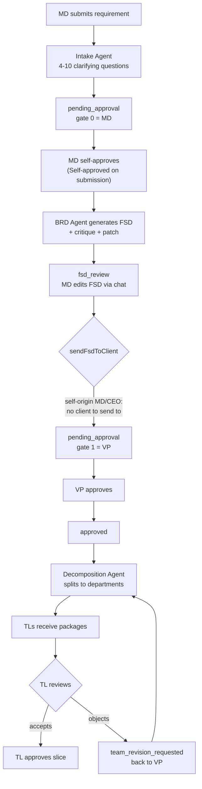
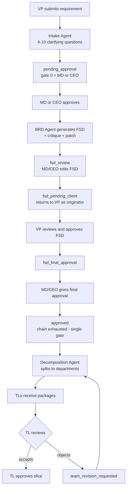
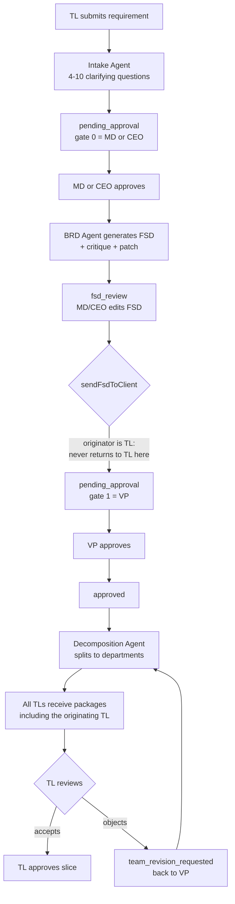

# Architecture Plan — Intake to Decomposition

**Status:** Proposal, not yet implemented
**Scope:** Agents 1–4 (Intake → BRD → UI → Decomposition), the departmental governance model, and Git as the artefact backbone. Code generation onward is deliberately out of scope.
**Source documents:** *AI-Enabled Software Factory — Solution Proposal v1.0* (July 2026) and *Scope of Work for AI enabled SDLC using DevSecOps with GitHub*.

Throughout, **Proposal §n / Dn** refers to the Solution Proposal, and **SoW n.0** to the numbered rows of the Scope of Work.

---

## 1. Why this plan exists

The current implementation delivers the right *behaviour* for the intake-to-decomposition stages — multi-turn refinement, a structured BRD, approval routing, and decomposition all work, and some exceed their stated acceptance criteria. What it does not deliver is the *architecture* those documents commit to. Two named layers are absent entirely rather than partially built:

- **Agent orchestration framework** — committed in SoW 5.0, with "platform and agent build, cross-agent integration testing" named as a delivery phase in SoW 8.0. The pipeline is currently plain JavaScript control flow calling single-purpose LLMs.
- **Git as the system of record** — SoW 4.0 commits that "Requirements, BRDs, designs, prompts, skill files and code are all version-controlled in Git". Every artefact currently lives in MongoDB; there is no Git integration of any kind.

Several gaps that look independent are in fact symptoms of the second point. BRD versioning (SoW 10.0), prompt-template versioning with approver identity (SoW 4.0), and the four missing audit-trail fields (SoW 7.0) were all committed to be delivered *via Git*. They are one missing layer, not several separate tasks.

A note on interpretation: agents 1–4 produce documents rather than code, so "CI/CD" at this stage means Git and GitHub Actions acting on artefacts — validation checks and PR-based approval gates — rather than build and deploy pipelines.

---

## 2. Three reconciliations

The two source documents and the existing build disagree in three places. Each is resolved deliberately below rather than silently.

### 2.1 Departments vs dependency-ordered work items

Proposal §2.3 and D3 specify decomposition into "scoped, dependency-ordered work items". Neither document mentions departments or team leads anywhere. The existing build decomposes into five fixed departments (QA, AI, Development, DevOps, Sales & Marketing) — a structure that appears to derive from Stark Digital's own delivery pod in Proposal §9, which describes engagement staffing, not the pipeline's decomposition model.

**Resolution — two-level decomposition.** The Decomposition agent emits work items carrying a real dependency graph, *and* assigns each work item an owning department. The graph satisfies D3; departmental ownership and TL approval survive intact. One department may own several work items.

This is stronger than either model alone. Five independent department packages do not naturally cohere — the entity-ownership repair currently required after every split exists precisely because nothing forces the slices to agree. A dependency graph makes that ordering explicit rather than emergent.

### 2.2 Analyst gate vs TL gates

D3 requires "an analyst review/approval gate before code generation", with the analyst able to edit and approve. The existing build has TLs approving their own department packages, and no gate on the decomposition itself — `giveFinalFsdApproval` flips the artefact to `approved` and generates team reports in a single step, after which code generation is permitted.

**Resolution — keep both, as distinct gates.** The VP approves the work-item graph as a whole (satisfying D3), then each TL approves their own slice (preserving the existing governance model).

### 2.3 UI stage position

SoW 11.0 and 12.0 place UI generation and approval between BRD approval and code generation, and state that "code generation for the affected scope cannot start until UI approval is recorded". The existing build has no UI agent; the closest equivalent — the project-demo synthesis — runs *after* all code is generated, so the artefact meant to gate code generation is currently a by-product of it.

**Resolution — insert the UI agent in its specified position, before decomposition**, so work items are scoped against approved screens.

Ordering note: the two documents each omit what the other includes. Proposal §2 sequences BRD approval → decomposition → code generation and never mentions UI. SoW sequences BRD approval → UI → UI approval → code generation and never mentions decomposition. UI-before-decomposition is a judgement call, taken because the UI is application-wide while work items are slices of it.

---

## 3. Target flow

```
Intake agent ──▶ BRD agent ──▶ [GATE 1: BRD approval]
                                      │
                              UI agent ──▶ [GATE 2: UI approval]
                                      │
                          Decomposition agent
                                      │
                    [GATE 3: VP approves work-item graph]
                                      │
                    [GATE 4: each TL approves their slice]
                                      │
                              ──▶ (code generation — out of scope)
```

Rejection at GATE 1 closes the request with the reason recorded and the audit trail retained (SoW 10.0). Rejection at any later gate returns the artefact to its producing agent for revision.

---

## 4. Requirement approaches

§3 shows the target flow in the abstract. In practice a requirement takes a different path depending on who raised it, because the approval chain is keyed on originator tier. The diagrams below describe the **currently implemented** routing, derived from `config/hierarchy.config.js` and `services/stateMachine.service.js`; the agent nodes shown are the target-state agents from §5.

| Originator | Chain |
|---|---|
| MD | `[md]` → `[vp]` |
| CEO | `[ceo]` → `[vp]` |
| **VP** | `[md, ceo]` — **single gate** |
| PM | `[md, ceo, vp]` — single gate |
| TL | `[md, ceo]` → `[vp]` |
| Client | `[md, ceo]` → `[vp]` |

A VP cannot approve their own requirement — VP-originated work escalates upward to MD/CEO and has no VP gate at all.

### 4.1 Originated by MD



**Governance note.** MD approves at gate 0 on their own artefact. SoW 6.0 commits that *"a requester cannot approve their own artefact"*. An independent VP gate still follows, and the MD/CEO peer-bypass was removed so VP cannot be substituted — but this remains an open decision (§10).

### 4.2 Originated by VP



**Governance note.** VP-originated has the cleanest segregation of duties of the three — the originator never approves their own gate, and the FSD returns to them for review as the requesting party rather than as an approver.

### 4.3 Originated by TL



**Governance note.** A TL-originated requirement deliberately skips the client-review loop. Per `stateMachine.service.js`: *"TL requirements always move from the MD/CEO FSD review to the existing VP gate. They do not return to the originating TL until VP releases the generated production packages."*

### 4.4 What these diagrams do not yet show

All three depict current behaviour, in which GATE 2 and GATE 3 from §3 do not exist:

- **No UI stage.** Decomposition follows BRD approval directly; §2.3 inserts the UI agent and GATE 2 between them.
- **No decomposition gate.** `approved` triggers the split immediately, and `/codegen/start` checks only `currentStage === 'approved'`. §2.2 adds GATE 3.
- **TL approval is not yet a gate.** TLs can edit a slice and raise `team_revision_requested`, but nothing blocks code generation on their approval.

---

## 5. Agents

| # | Agent | Responsibility | Internal loop |
|---|-------|----------------|---------------|
| 1 | **Intake** | Multi-turn refinement until the requirement is complete and unambiguous | Bounded question budget (see §8) |
| 2 | **BRD** | Produce the structured BRD; revise on rejection | Critique → patch |
| 3 | **UI** | Generate React screens under the design-system skill file | Clarification requests where the BRD is ambiguous (SoW 11.0) |
| 4 | **Decomposition** | Emit work items, dependency edges, and department assignment | — |

Agents are graph nodes with typed state, kept **deterministic**: fixed sequence, forced tool schemas, no autonomous tool selection. The framework supplies checkpointing, retries, streaming and tracing; it does not supply model autonomy.

This is a deliberate choice. Repeated failures in the current pipeline stem from models not reliably following instructions, and every verify-then-repair mechanism in the codebase exists because a prompt alone was insufficient. Widening model discretion would amplify that failure mode, not reduce it.

**Deliberately not agents:** security scanners, CI execution, deployment, Git operations, audit and consumption logging, and all human gates. These are deterministic and must stay so. The most serious defect found to date was a security scanner silently scanning an empty directory while reporting success — no AI layer above it noticed, because the AI layer was never the thing being trusted.

---

## 6. Git as the system of record

### 6.1 Repository strategy

**One governance monorepo, one folder per requirement.** Not a repository per requirement.

Repository-per-requirement would require org-level repository-creation rights for the GitHub App, accumulate one repository per requirement indefinitely, demand CODEOWNERS and branch-protection configuration on each, and make cross-requirement search impractical.

There is a genuine case for a separate repository — but only for **generated application code**, which needs its own CI, release history and deployment. That belongs to the code agent, which is out of scope here (§11). **That decision is therefore deferred**, not taken: governance artefacts monorepo now; application-code repository strategy settled when code generation is in scope.

```
ai-factory-requirements/
├── prompts/                              versioned prompt templates (SoW 4.0)
│   ├── intake.md
│   ├── brd.md
│   └── decomposition.md
└── requirements/
    └── <artifactId>/
        ├── requirement.md                intake transcript + structured summary
        ├── brd/
        │   ├── brd.json                  structured BRD
        │   └── diagrams/*.mmd            architecture and ER diagrams, separately lintable
        ├── ui/
        │   ├── screens/*.jsx             UI agent output
        │   └── design-system.skill.md    design-system skill file (SoW 11.0)
        └── workitems/
            ├── graph.json                work items + dependency edges + owning department
            └── <dept>/*.json             per-department slices
```

### 6.2 Commit discipline

Each agent commits **once, on completion** — never mid-run.

| Agent | Files written | Commit author |
|---|---|---|
| Intake + Finalize | `requirement.md` | `intake-agent[bot]` |
| BRD (post critique/patch) | `brd/brd.json`, `brd/diagrams/*.mmd` | `brd-agent[bot]` |
| UI | `ui/screens/*.jsx`, `ui/design-system.skill.md` | `ui-agent[bot]` |
| Decomposition | `workitems/graph.json`, `workitems/<dept>/*.json` | `decomposition-agent[bot]` |

**Deliberately not committed:** individual intake turns, which would produce up to ten noise commits per requirement — the live conversation belongs in the LangGraph checkpoint until intake completes. Intermediate BRD critique rounds are likewise excluded; only the final patched document is an artefact anyone approved.

### 6.3 Pull requests — one per gate

**Every agent writes to a branch and opens a pull request. Every gate is a PR approval.** For an MD-originated requirement split across four departments, eight pull requests:

| PR | Branch | Contents | Reviewer | Gate |
|---|---|---|---|---|
| 1 | `req/<id>/requirement` | `requirement.md` | Per chain gate 0 | Gate 0 |
| 2 | `req/<id>/brd` | BRD + diagrams | VP | GATE 1 |
| 3 | `req/<id>/ui` | Screens + skill file | UI/UX + BA | GATE 2 |
| 4 | `req/<id>/workitems` | `graph.json` only | VP | GATE 3 |
| 5–8 | `req/<id>/wi-<dept>` | That department's slice | Owning TL | GATE 4 |

The work-item graph and the department slices are deliberately separate pull requests: they are distinct gates with distinct approvers, and splitting them means one TL revising a slice does not block the other departments — matching the behaviour of `team_revision_requested` today.

**Merge is the approval record.** The review is the gate, the merge commit is the audit entry, and the commit SHA is the artefact version — supplying SoW 7.0's missing `artefact version` field without bespoke code.

### 6.4 Reviewer enforcement

`CODEOWNERS` maps approval tiers onto GitHub teams, enforced by branch protection:

```
/requirements/*/brd/                    @stark/tier-md @stark/tier-ceo @stark/tier-vp
/requirements/*/ui/                     @stark/tier-vp
/requirements/*/workitems/graph.json    @stark/tier-vp
/requirements/*/workitems/development/  @stark/tl-development
/requirements/*/workitems/qa/           @stark/tl-qa
/prompts/                               @stark/tier-vp
```

This satisfies SoW 6.0's "branch protection and required-reviewer rules enforced at repository level", and gives segregation of duties natively, since GitHub prevents an author approving their own pull request.

**One limitation to design around.** GitHub reviews are unordered: branch protection can require an approval from CODEOWNERS, but cannot express *"gate 0 = MD, then gate 1 = VP"*. Approval chains are sequential. The division is therefore: **GitHub enforces who may approve; the graph enforces the order.** The orchestrator requests reviewers only for the current gate and resumes only on an approval whose tier matches `approvalChain[currentApprovalIndex]`; an approval from a later-gate tier arriving early is ignored.

### 6.5 Authentication

A **GitHub App**, not a personal access token — required for webhook delivery, fine-grained per-repository permissions, and commit attribution to a named agent bot rather than to an individual's credentials. Approvals return via a `pull_request_review` webhook, which resumes the paused graph.

**Reliability note.** A missed webhook leaves a graph thread paused indefinitely. A reconciliation job must poll open pull requests and resume any already approved.

### 6.6 What this closes

Adopting Git as the artefact backbone closes, without bespoke code, the artefact versioning of SoW 10.0, prompt-template versioning with approver identity of SoW 4.0, and the four audit-trail fields missing from SoW 7.0 (model, model version, prompt version, artefact version). GitHub supplies approver identity, timestamps, immutable history and rollback natively.

**State split.** Git holds artefacts and approvals. MongoDB retains workflow state — current stage, in-flight chat, poll status — as a projection rebuilt from Git. SoW 18.0 anticipates exactly this split: "Single source of record in Git plus the workspace."

### 6.7 Segregation of duties

SoW 6.0 commits that "a requester cannot approve their own artefact". The current implementation records `Self-approved on submission` when an MD or CEO originates a requirement — the originator recording an approval on their own artefact. An independent VP gate still follows, so it is not solely self-approved, but the specific control named in the document is not honoured.

Moving gates to PR approvals makes this enforceable at repository level via branch protection and required-reviewer rules, as SoW 6.0 describes. **Whether self-approval at gate 0 is acceptable is a client decision and should be settled explicitly, not left to be discovered in an audit.**

---

## 7. CI checks

GitHub Actions on every artefact pull request. This migrates the invariants currently enforced at runtime into gates that block a merge.

| Check | Enforces |
|-------|----------|
| BRD schema validation | All required fields present |
| Mermaid lint | Both diagrams parse |
| Work-item graph | Acyclic; every dependency resolves; every item has exactly one owning department |
| Entity ownership | Exactly one owner per entity, no orphans |
| Cross-department naming | Shared entities spelled identically across all slices |
| Prompt-template diff | Prompt changes require an approver (SoW 4.0) |

The entity-ownership and cross-department-naming checks correspond to defects already observed in generated output, where one department created a table `Return_Items` while another wrote a foreign key against `ReturnItems` — a mismatch that produces an unbuildable combination.

A failing check blocks its gate. This is the substantive form of SoW 18.0's "mandatory gate set enforced in pipeline configuration".

---

## 8. Carried-forward guarantees

Behaviour already implemented and verified that must survive the migration:

- **Intake question budget** — a floor of 4 clarifying questions and a ceiling of 10, enforced in code rather than by prompt. Cost grows quadratically with conversation length, because each turn re-sends the full transcript; an unbounded intake was measured at roughly 7.5× the token cost of a bounded one.
- **BRD critique and patch** — a fresh-context reviewer inspects the finished BRD and a second pass applies its findings. Where the patch cannot be applied, unresolved findings are appended to `openQuestions` rather than discarded.
- **Entity ownership normalisation** — exactly one owner per entity, repaired deterministically after decomposition.
- **Cross-department consistency context** — supplied at the point code is actually written, not only at planning time.

---

## 9. Migration path

Ordered so that each step is independently valuable and low-risk before it.

1. **Git backbone, no agent changes.** Write existing artefacts to a repository; open PRs for gates. Highest value, lowest risk, closes the largest cluster of SoW commitments.
2. **CI checks.** Move invariants from runtime into Actions.
3. **UI agent** in its specified position, with GATE 2.
4. **Two-level decomposition** — add the dependency graph alongside the existing department split.
5. **Port to the agent framework.** Last, once the flow is settled — porting a shape still being changed is wasted effort.

Steps 1–4 close real gaps without touching orchestration. Step 5 closes the agent-orchestration commitment of SoW 5.0 and 8.0.

---

## 10. Open decisions

| Decision | Options | Notes |
|----------|---------|-------|
| Orchestration framework | LangGraph.js · LangGraph Python · LangChain.js | LangGraph.js keeps everything in the existing Express process — no new language, service or IPC. A chain cannot express this pipeline: the flow has cycles (rejection, revision, critique→patch), pauses spanning days, and originator-dependent routing |
| ~~Repository strategy~~ | **Resolved — governance monorepo** (§6.1) | Application-code repository strategy remains deferred until code generation is in scope |
| GitHub tenancy | GitHub Enterprise · github.com | SoW 5.0 specifies Enterprise |
| LangGraph Studio | Local dev only · not at all | Studio is built around LangSmith, a hosted service. Traces carry prompts, outputs and BRD content. Proposal §6 commits that data remains within the client's Azure boundary, so Studio must not ship in the delivered platform and should not be pointed at real client requirements without written sign-off. LangGraph itself has no dependency on it |
| GATE 3 status | Real gate · folded into GATE 4 | The documents disagree — Proposal D3 requires an analyst gate; the SoW gate list in 6.0 omits it. Settle with the client |
| Self-approval at gate 0 | Permit · prohibit | SoW 6.0 says a requester cannot approve their own artefact |

---

## 11. Explicitly out of scope

Code generation and everything downstream: constrained generation with skill files (D4), automated change review and PR gate (D5), the security scanning suite (D6), test generation with the rollback loop (D7), UAT and production deployment (D8), and per-run consumption logging (D9).

These remain open commitments in the source documents and are not addressed by this plan.
