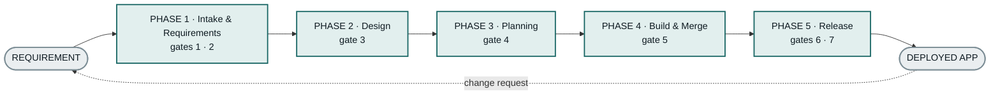
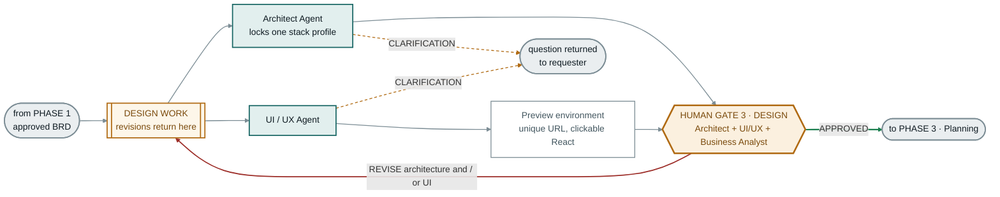
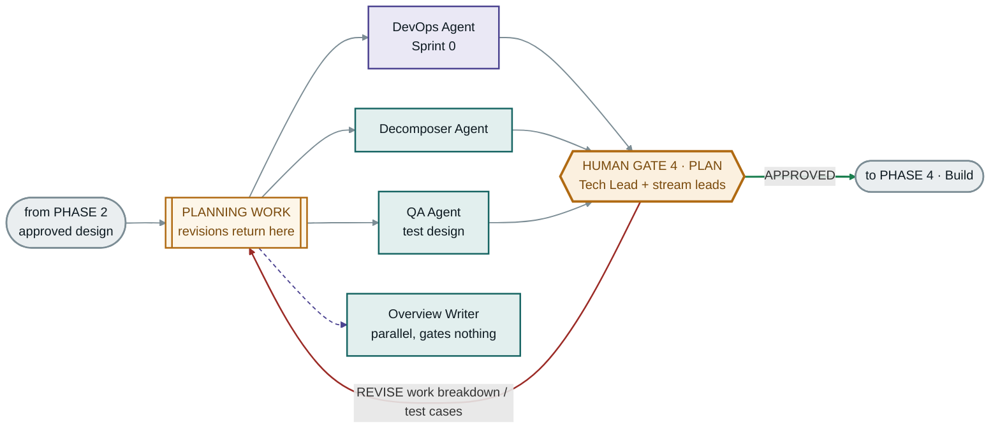
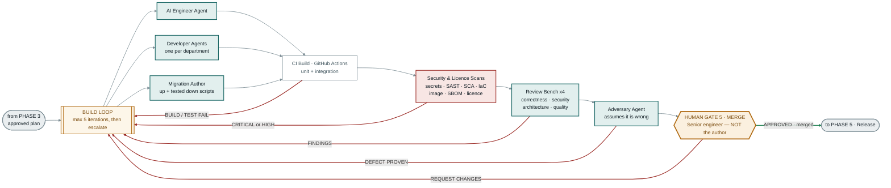

# Governed SDLC — Agents, Human Gates & System Architecture

Five phases, seven gates, fourteen agent roles, one architecture.
Every component traces to a Scope of Work row; §17 is the coverage map.

---

## 1. Overview



Five phases, seven gates. Nothing crosses a phase boundary without an approval.

### The stack this factory generates

**React on the frontend. Node.js or Python on the backend. PostgreSQL for data.**

Two backend tracks, not one — but a *closed* set of two, chosen once per project at
Gate 3 and locked for that project's lifetime. That distinction is the governance
point: the constraint is not "one framework forever", it is that the choice is made
deliberately from an approved set, at a known moment, by a named role — rather than
each requirement quietly arriving at a different answer. Every tool in the pipeline
that touches generated code maps onto one of the two tracks; anything requiring a third
runtime is out of the profile by definition.

Keep this separate from the stack the **platform itself** runs on. Temporal is Go,
LangGraph is Python, Backstage is TypeScript — that is plumbing, invisible to the
client, and unrelated to what gets delivered.

**The workflow template is chosen once, at intake.** It decides which stages apply
to this run — not which gates can be skipped. Four templates are defined in §10.

**Line colours** are consistent across every phase diagram:

| Colour | Meaning |
|---|---|
| Green | APPROVED — the gate passed, work advances |
| Red | REVISE / REJECT / FAIL / DISCARD — work goes back or stops |
| Amber dashed | Clarification request — the agent asks rather than assumes |
| Purple dashed | Parallel, non-gating |
| Grey | Normal forward progression, no decision involved |

---

## 2. Phase 1 — Intake & Requirements

```mermaid
flowchart LR
    R(["REQUIREMENT"]) --> WT["Workflow template<br/>+ approvers assigned"]
    WT --> A1["Intake Agent<br/>guardrail input rails"]
    A1 --> G1{{"HUMAN GATE 1 · SCOPE<br/>Product Owner<br/>requester excluded"}}
    G1 ==>|"APPROVED"| A2["BRD Agent"]
    A2 --> ED["BRD edited in workspace<br/>every revision versioned"]
    ED --> G2{{"HUMAN GATE 2 · BRD<br/>Business Owner + Client tech lead"}}
    G2 ==>|"APPROVED"| OUT(["to PHASE 2 · Design"])
    G1 -->|"REVISE"| A1
    G2 -->|"REVISE"| A2
    G1 -->|"DISCARD"| X(["request closed<br/>reason recorded, trail retained"])
    G2 -->|"DISCARD"| X

    linkStyle 0,1,2,4,5 stroke:#7C8D95,stroke-width:1.5px
    linkStyle 3,6 stroke:#1B7F4F,stroke-width:2.5px
    linkStyle 7,8,9,10 stroke:#9C2C27,stroke-width:2px
    classDef gate fill:#FBF0DF,stroke:#B06A12,stroke-width:3px,color:#7A4A0C
    classDef agent fill:#E2EFEE,stroke:#186664,stroke-width:2px,color:#0F1B22
    classDef term fill:#EAEEF0,stroke:#7C8D95,stroke-width:2px,color:#0F1B22
    classDef sys fill:#FFFFFF,stroke:#7C8D95,stroke-width:1.5px,color:#42565F
    class G1,G2 gate
    class A1,A2 agent
    class R,X,OUT term
    class WT,ED sys
```



### How it runs

**1 · Submission.** The requester signs into Backstage through Entra ID SSO and fills
the intake form. A requirement record is created and a Temporal workflow starts with
the requirement id as its workflow id — the requirement *is* the workflow, addressable
for its whole life.

**2 · Template and approvers resolved once.** The workflow template is chosen and the
approval chain is resolved from the originator's Entra group, then written onto the
requirement. Resolving once rather than per gate matters: a mid-flight change to an
Entra group would otherwise silently rewrite who was allowed to approve a decision
already in progress.

**3 · The intake conversation.** Each turn runs: requester's message → NeMo Guardrails
input rails → Presidio masks personal data → LiteLLM with a virtual key and a hard
token ceiling → model → Guardrails AI validates the reply's shape → back to the
requester. Between turns LangGraph's `interrupt()` parks and Temporal holds the
position, so a conversation left overnight consumes no compute and survives a
redeploy. The question budget is enforced in code, not by prompt.

**4 · The scope report.** Structured output — in scope, out of scope, assumptions,
open questions. The GitHub App commits it to `scope/<id>` and opens a pull request
with reviewers drawn from the Entra-synced Product Owner team.

**5 · Gate 1.** Temporal parks on a signal with a durable SLA timer. The reviewer
approves in GitHub or in the workspace — both produce the same event. The Gate Engine
verifies the webhook signature, then asks OPA three questions: is this identity in the
approver set, is it *not* the originator, and is this the gate we are actually waiting
on. Pass signs an attestation, merges the branch, and releases the workflow.

**6 · The BRD.** The BRD Agent reads the approved scope from `main` and writes the
document against the configured BRD template, assigning a traceability id to every requirement
that is carried forward to ticket, test, commit and attestation. A fresh-context
critique pass reviews the result; unresolved findings are appended to open questions
rather than dropped.

**7 · Editing.** The document renders in Backstage and the business owner edits it
directly. Each save is a commit on `brd/<id>` carrying the editor's Entra identity —
which is how "editable in-workspace, every revision versioned" is satisfied without
building a version store.

**8 · Gate 2.** Same mechanism, two required reviewers from distinct teams. Approve
merges and opens Phase 2; discard closes the request with the reason recorded.

### What Phase 1 uses

Every component below is free and open source, licence verified by reading the file
rather than trusting the GitHub badge — four projects in this list report the wrong
licence on their repository page.

| Concern | Component | Licence | Stars |
|---|---|---|---|
| Model egress — virtual keys, hard budgets, model allow-list | **LiteLLM** | MIT core | 58,261 |
| Workspace shell, intake form, approval inbox, BRD editor | **Backstage** | Apache-2.0 | 34,367 |
| Prompt version registry, token and cost telemetry | **Langfuse** | MIT core | 34,323 |
| Precedent retrieval over past approved BRDs | **pgvector** | PostgreSQL | 22,949 |
| Durable workflow — a gate paused for days at zero compute | **Temporal** | MIT | 22,897 |
| Approval policy — who may approve, evaluated out of process | **OPA** | Apache-2.0 | 12,212 |
| Personal-data masking before anything leaves the tenant | **Presidio** | MIT | 10,776 |
| Output validation — schema conformance, correct / retry / filter | **Guardrails AI** | Apache-2.0 | 7,369 |
| Input rails — topic control that keeps intake on scope | **NeMo Guardrails** | Apache-2.0 | 7,082 |
| Attestation signing at each gate | **Sigstore + in-toto** | Apache-2.0 | 6,286 |
| Agent graph with a genuinely resumable pause | **LangGraph** | MIT | 41,233 |
| Requirement record, approval chain, workflow state | **PostgreSQL** | PostgreSQL | — |
| Identity and system of record | Entra ID · GitHub Enterprise | *commercial* | — |

The last row is the only one that costs anything, and it costs nothing **to us**: both
are named in the SoW and both are already owned by the client. Free equivalents exist
if that ever changes — Keycloak for Entra ID, Gitea for GitHub Enterprise — but either
would contradict the SoW as written.

Two of these are **open core**: LiteLLM fences third-party moderation wrappers under
`enterprise/`, Langfuse fences its audit-log viewer, SSO settings and admin API under
`ee/`. Neither fence blocks a Scope of Work requirement — LiteLLM's budgets, keys,
allow-list and request logging are all in the MIT core, and Langfuse's audit *data*
lands in our own Postgres, where only the viewer UI is commercial.

### Skill files Phase 1 takes

Agent behaviour is not written from scratch. Five existing MIT-licensed skill files
are vendored at a pinned version and constrained by our own, rather than replaced.

| Skill file | Source | Used for |
|---|---|---|
| `bmad-agent-analyst` | BMAD-METHOD, MIT | The intake persona — requirements elicitation and scope framing |
| `bmad-agent-pm` | BMAD-METHOD, MIT | The BRD persona — translates approved scope into a structured document |
| `bmad-prd` | BMAD-METHOD, MIT | The document-writing workflow the BRD persona invokes |
| `bmad-advanced-elicitation` | BMAD-METHOD, MIT | A catalog of **71 elicitation methods across 12 categories**, served by script so the catalog never enters context whole |
| `spec-driven-development` | addyosmani/agent-skills, MIT | Scope-report structure — objective, boundaries, success criteria, open questions |

**They are configured, not forked.** BMAD resolves each agent from three files merged
in order — its own defaults, our team overrides, then personal overrides — so our
changes live in `_bmad/custom/*.toml` and BMAD updates cleanly underneath. One of the
override fields, `persistent_facts`, accepts file references, which is how our own
skill file is injected without touching theirs.

**Attribution obligation.** MIT requires the copyright and permission notice to travel
with copies or substantial portions, so every vendored skill is listed in
`THIRD-PARTY-NOTICES.md`. BMAD additionally holds trademarks on its name: the code may
be used and sold commercially, but nothing we ship may be named or branded as BMad.

### What Phase 1 builds

Four things, because nothing open source provides them.

| Component | Why it does not exist | Ref |
|---|---|---|
| **Gate Engine** | A gate is not a button. It is a durable wait carrying an SLA timer, escalation when nobody responds, segregation-of-duties enforcement, and a resumable verdict later stages branch on. Includes resolving the approval chain once from Entra groups and writing it onto the requirement. | C1 |
| **`intake.skill.md`** | The capability boundary — what this platform can and cannot build — plus the clarification-question policy, its 4-to-10 budget, the scope-bounding rules and the client's own vocabulary. Injected whole rather than retrieved, because a boundary resolved by similarity search answers differently on different days. | — |
| **Attestation predicate + Run Ledger** | Actor, timestamp, model *and version*, prompt version, artefact version and decision is not a table anyone ships. It is a custom in-toto predicate signed at every gate, plus the graph tying requirement to ticket, test, commit and approval. | C5 |
| **Workflow templates** | No framework ships the choice of which stages apply to a run, or the approver assignment that goes with it. | C3 |

Three of the ten from-scratch components in the whole system are exercised here. Phase
1 has the fewest agents and the most original engineering, because it is the
governance phase — and governance is the part nobody sells you.

### Where state lives

Git holds every artefact and attestation and is authoritative. Postgres holds the
requirement record, the resolved approval chain and Temporal's workflow state.
Langfuse holds tokens, cost and prompt versions. GitHub holds pull requests and
reviews. **If Postgres and Git disagree about an artefact, Git wins** — process state
belongs to one, content to the other, and two authorities over the same data is how a
workspace ends up showing something different from what was approved.

The only phase where a request can be **discarded** outright. After Gate 2 the work
is corrected rather than abandoned.

**The requester is not an approver at Gate 1.** Segregation of duties is enforced by
policy, not convention — the same identity cannot appear as originator and approver
on one artefact.

**The BRD is edited in the workspace,** not only regenerated. A reviewer refines the
document directly; every revision is versioned and attributed.

---

## 3. Phase 2 — Design



### How it runs

Gate 1 and Gate 2 released a BRD with testable acceptance criteria. Two agents now
read it at the same time and neither waits for the other.

**The Architect Agent** decides module boundaries, the data model, API contracts and
non-functional requirements, and records the reasoning as ADRs so a later reviewer can
see *why* a choice was made. Its most consequential act is selecting **one stack
profile from a pre-approved set and locking it for the run** — React on the frontend,
Node.js or Python on the backend, with the rest of the profile fixed at the same
moment. Left unconstrained an agent will recommend a different database on every
project, which is the inconsistency a governed factory exists to prevent.

**The UI/UX Agent** generates real React screens, not images of screens, and renders
them into an ephemeral E2B preview with a unique URL the business reviewer can click
through. It is constrained by `design-system.skill.md` — tokens, components,
accessibility rules — so output is consistent across projects rather than reinvented
each time. Screens are generated one at a time against a roster of their siblings, so
a truncated response costs one screen rather than the whole design.

**Either agent can stop and ask.** A clarification request returns to the requester and
the answer is appended to the BRD's revision history, so the next phase reads one
document rather than a document plus a thread.

**Gate 3 takes three roles** — architect, UI/UX and business analyst — because the
question being answered is three questions: is this buildable, is it usable, and is it
what the business asked for. A revision returns to the shared DESIGN WORK node, so
screens can be sent back without touching the architecture.

### What Phase 2 uses

| Concern | Component | Licence | Stars |
|---|---|---|---|
| Architecture diagrams | **Mermaid** | MIT | 90,158 |
| Visual editing, if a reviewer nudges a screen directly | **Onlook** | Apache-2.0 | 26,662 |
| Local app builder, bring-your-own-key across providers | **Dyad** | Apache-2.0 core | 21,397 |
| Firecracker microVM hosting the ephemeral preview | **E2B** | Apache-2.0 | 13,710 |
| Brownfield context — packing, structure, symbol-precise edits | Repomix · CodeGraph · Serena | permissive | — |

The whole Phase 1 substrate carries over unchanged: Temporal, LangGraph, LiteLLM,
Langfuse, OPA, Guardrails AI, Presidio, Sigstore, Backstage, PostgreSQL, GitHub.

**Two to avoid, both from the reference architecture's own shortlist.** *bolt.diy* is
MIT with 19,858 stars but was last pushed in February — seven months stale. *PlantUML*
is **LGPL-3.0**, which would be the only strong copyleft anywhere in this stack;
Mermaid is MIT, already renders the diagrams in this document, and costs nothing to
adopt instead.

**Dyad is open core** — Apache-2.0 except `src/pro/`. That is the third open-core
project in the stack after LiteLLM and Langfuse, which is frequent enough to warrant a
standing licence re-check rather than a one-off.

### Skill files Phase 2 takes

Five more from BMAD, MIT, from the repository already vendored in Phase 1.

| Skill file | Used for |
|---|---|
| `bmad-agent-architect` | The architect persona |
| `bmad-agent-ux-designer` | The UX persona |
| `bmad-architecture` | Recording the architecture decisions that keep separately built parts consistent — the ADR workflow |
| `bmad-ux` | Captures the UX vision as `DESIGN.md` and `EXPERIENCE.md` |
| `bmad-spec` | Condenses mixed input — brief, PRD, notes — into a short spec |

### What Phase 2 builds

| Component | Why nothing exists |
|---|---|
| **`design-system.skill.md`** | Tokens, components and accessibility rules for this client. Nobody ships someone else's design system. |
| **Stack profiles** | The pre-approved set the Architect selects from and locks for the run. Left unconstrained an agent recommends a different database on every project — the exact inconsistency a governed factory exists to prevent. |
| **Per-screen generation with a compile gate** | One model call per screen against a roster of its siblings, then a parse against the preview runtime with a bounded retry that hands the model its own error. A truncation costs one screen rather than the whole design, and no screen reaches a reviewer unrenderable. |
| **The clarification loop** | Agent raises a question, it returns to the requester, and the answer is appended to the BRD's revision history — so Phase 3 reads one document rather than a document plus a thread. |

### The two stack profiles

The Architect selects one profile and locks it for the run. Both are free and open
source throughout; a proprietary dependency requires a documented exception, never a
default. Every licence below was verified by reading the file.

| Layer | Node track | Python track |
|---|---|---|
| Frontend | **React** — MIT | **React** — MIT |
| API framework | **Express** — MIT · or **Next.js** route handlers — MIT | **FastAPI** — MIT · or **Django REST** — BSD-3 |
| Data access | **Prisma ORM** — Apache-2.0 | **SQLAlchemy** — MIT |
| Migrations | **Prisma Migrate** | **Alembic** — MIT |
| Unit and integration tests | **Vitest** — MIT | **Pytest** — MIT |
| Lint and format | **ESLint + Prettier** — MIT | **Ruff** — MIT |
| Database | **PostgreSQL** | **PostgreSQL** |

**What locking a profile actually does.** The Test Architect writes Vitest *or* Pytest,
never both in one project. The Migration Author writes Prisma Migrate *or* Alembic. The
Developer Agents receive the profile in their ticket context.

**Context alone is not enforcement**, and it should not be described as though it were:
an agent handed a profile can still add a dependency outside it. Three things make the
profile hold. The **review bench's architecture-conformance lane** detects an off-profile
dependency in the diff. A **dependency allow-list check in CI**, generated from the
locked profile, fails the build rather than flagging it. And **Trivy's SBOM output**
makes the actual dependency set auditable at Gate 5 rather than assumed. The first
catches it, the second prevents it, the third proves it.

The security scanners — Gitleaks, Trivy, Syft, ScanCode and ZAP — are language-agnostic,
and static analysis is per-track: **Bandit** on Python and **eslint-plugin-security** on
JavaScript and TypeScript, both Apache-2.0 and both shipping their own rules.

**Anything needing a third runtime is outside the profile by definition.** A JVM tool, a
.NET dependency or a Go service is not a judgement call at review time; it fails the
profile at Gate 3. That is why the migration runner names Prisma Migrate and Alembic
and nothing else — a JVM-based migration tool would drag a Java runtime into a project
that has no other use for one.

**Precedent retrieval is disabled in this phase.** An Architect Agent shown the
previous project's schema produces something coherent and internally consistent that
is wrong for this requirement — and a reviewer approves it because it looks fine.
Each architecture is derived from this BRD alone. See §13.

**Phase 2 builds less than Phase 1.** The Gate Engine, the attestation predicate and
the Run Ledger already exist and are reused; Gate 3 is configuration on top of them,
not new engineering.

Architecture and UI run in parallel and share one gate. A revision returns to the
DESIGN WORK node, from which either agent can be re-run — the reviewer can send back
the screens without touching the architecture.

**Either agent can stop and ask.** Where the BRD is ambiguous the agent raises a
clarification request rather than inventing an answer; the question returns to the
requester and the reply is appended to the BRD's revision history.

---

## 4. Phase 3 — Planning



### How it runs

Nothing in this phase writes application code. It exists so that Phase 4 can start
without stopping.

**The DevOps Agent runs Sprint 0** — repository, branch protection, CI pipeline,
environment configuration, infrastructure-as-code and secrets wired to Key Vault. On a
brownfield project against provisioned infrastructure the workflow template skips it
entirely.

**The Decomposer Agent** breaks the BRD into tickets in dependency order and assigns
each to a department stream. It runs *after* both architecture and UI are approved
because ticket boundaries follow the screens. Every ticket carries a path allow-list,
which becomes the enforcement boundary the builder agents are held to at tool level.
Two checks run before the split is accepted: every entity has exactly one owning
department, and shared entities are spelled identically across streams — a defect that
otherwise surfaces as one department creating `Return_Items` while another writes a
foreign key against `ReturnItems`.

**The QA Agent designs tests** from the acceptance criteria and the approved screens,
**before any code exists**. This is what forces acceptance criteria to be genuinely
testable: a criterion no test can be written against was never specific enough, and
finding that here costs nothing.

**The Overview Writer** runs alongside, reads the approved BRD only, and produces a
plain-language product summary. It gates nothing and cannot delay the build.

**Precedent retrieval is disabled here too.** A department split that inherits the
shape of the last one produces tickets that read perfectly reasonably and divide the
wrong work. The split follows from this BRD and these screens only — see §13.

**Gate 4 needs every stream lead to sign, not just the Tech Lead** — an AND across
departments. A dependency that one department accepts and another has not seen is
exactly the defect this gate exists to catch.

### What Phase 3 uses

| Concern | Component | Licence | Stars |
|---|---|---|---|
| Infrastructure as code at Sprint 0 | **OpenTofu** | MPL-2.0 | 30,119 |
| GitOps sync for the prepared environments | **Argo CD** | Apache-2.0 | 24,101 |
| IaC scanning before the pipeline is declared green | **Checkov** | Apache-2.0 | 8,988 |
| Pipelines, branch protection, secrets | GitHub Actions · Azure Key Vault | *client-owned* | — |

OpenTofu rather than Terraform: Terraform moved to the Business Source Licence, and
OpenTofu is the permissively-licensed fork under the Linux Foundation.

### Skill files Phase 3 takes

| Skill file | Source | Used for |
|---|---|---|
| `bmad-create-epics-and-stories` | BMAD, MIT | Breaking the approved BRD into ordered work items |
| `bmad-sprint-planning` | BMAD, MIT | The implementation-readiness check that runs before the gate |
| `bmad-qa-generate-e2e-tests` | BMAD, MIT | Test-case design from acceptance criteria, before code exists |
| `bmad-product-brief` · `bmad-prfaq` | BMAD, MIT | The Overview Writer's plain-language summary |
| `deployment-engineer` | wshobson/agents, MIT, 39,488★ | The DevOps Sprint 0 starting prompt |

### What Phase 3 builds

| Component | Why nothing exists | Ref |
|---|---|---|
| **Department routing rules** | Splitting an approved BRD into AI, DevOps, QA, Development and Sales work streams with dependency ordering is genuinely new — BMAD and Spec Kit both split by epic or feature, not by organisational department. | C2 |
| **Entity-ownership and naming checks** | Exactly one owning department per entity, shared entities spelled identically across streams, repaired deterministically. Corresponds to an observed defect: one department creating `Return_Items` while another wrote a foreign key against `ReturnItems`. | — |
| **Path allow-lists per ticket** | The enforcement boundary each builder agent is held to at tool level in Phase 4. Generated here because ticket boundaries are decided here. | — |
| **The AND-gate across stream leads** | Gate 4 requires every stream lead to sign, not just the Tech Lead. An extension of the Phase 1 Gate Engine rather than a new component. | C1 |

Three things happen before any code is written: DevOps prepares the ground, the work
is broken into tickets, and QA writes the test cases. **DevOps Sprint 0 is a
prerequisite, not a work stream** — the build cannot start until it is green.

The Overview Writer runs alongside and blocks nothing.

---

## 5. Phase 4 — Build & Merge



### How it runs

**The Execution Router picks an engine per ticket** by task shape and cost ceiling, and
logs which one ran — engine choice is an audited decision, not an implementation detail.
The three it dispatches to are named below: the Agentless pattern for localised changes,
**OpenHands** for sandboxed multi-file work, and **SWE-agent** for exploratory work under
a turn cap. Builder agents then work inside E2B microVMs with an egress allow-list, each
confined to its ticket's path allow-list.

**Context is assembled, never handed over whole.** No agent sees an entire repository.
Repomix packs a token-budgeted context, CodeGraph answers structural questions without
code leaving the tenant, and Serena makes symbol-precise edits instead of regenerating
whole files. The budget is an input to the stage rather than a hope.

**Three builder roles run in parallel.** The AI Engineer builds models, prompts,
inference and evaluation harnesses. The Developer Agents — one per department — build
frontend, API and integrations. The Migration Author owns schema and data migrations
alone, and **writes the down-script in the same change as the up-script**; a migration
without a tested rollback does not reach the gate.

**Then the machine filters, in order.** GitHub Actions runs unit and integration tests
against a **coverage threshold**, with property-based tests on rules-heavy modules.
Eight scanners run before merge — Gitleaks for secrets, Bandit and
eslint-plugin-security for per-track static analysis, Opengrep for cross-function taint,
Trivy for dependencies and images, Checkov for infrastructure, and Syft with ScanCode
for SBOM and licence — with DefectDojo de-duplicating findings and tracking SLAs. The Review Bench
splits into four lanes: correctness, security, architecture conformance and quality.
Finally the Adversary Agent assumes the artefact is wrong and tries to prove it — the
only reviewer not trying to be helpful, which is why it is cheap and productive.

**Only then does a human look.** By the time the senior engineer opens the pull request
it has compiled, passed its tests, cleared eight scanners, survived four review lanes and
an adversary. Their attention goes to judgement, not to defects a machine could have
found — which is the whole reason review throughput survives at scale.

### What Phase 4 uses

| Concern | Component | Licence | Stars |
|---|---|---|---|
| Dependency and container image scanning | **Trivy** | Apache-2.0 | 37,831 |
| Secret scanning | **Gitleaks** | MIT | 29,166 |
| Static analysis — Python | **Bandit** | Apache-2.0 | 8,253 |
| Static analysis — JS / TS | **eslint-plugin-security** | Apache-2.0 | 2,374 |
| Taint analysis across both tracks | **Opengrep** | LGPL-2.1 | 3,058 |
| Sandboxed agent execution, egress allow-listed | **E2B** | Apache-2.0 | 13,710 |
| Pull-request review comments | **PR-Agent** | MIT | 12,894 |
| SBOM generation | **Syft** | Apache-2.0 | 9,535 |
| Infrastructure-as-code scanning | **Checkov** | Apache-2.0 | 8,988 |
| Findings de-duplication and SLA tracking | **DefectDojo** | BSD-3-Clause | 4,924 |
| Licence compliance | **ScanCode** | Apache-2.0 | 2,618 |
| Context assembly under a token budget | Repomix · CodeGraph · Serena | permissive | — |
| Migrations, per stack profile | Alembic *(Python)* · Prisma Migrate *(Node)* | permissive | — |
| Coverage threshold | Vitest built-in *(Node)* · **pytest-cov** *(Python)* | MIT | 2,061 |
| Property-based testing | **fast-check** *(Node)* · **Hypothesis** *(Python)* | MIT / MPL-2.0 | 5,142 / 8,951 |
| Mutation testing, nightly | **Stryker** *(Node)* · **mutmut** *(Python)* | Apache-2.0 / BSD-3 | 3,093 / 1,429 |
| CI runners | GitHub Actions | *client-owned* | — |

**Why not Semgrep.** Its engine is LGPL-2.1 and would have been usable. Its **rules are
not open source**: `semgrep/semgrep-rules` carries the *Semgrep Rules License v1.0*,
which grants use *"for your own internal business purposes"* and states that it *"does
not allow you to distribute the rules, or to make them available to others as a
service."* A SAST engine without rules does nothing, so that licence — not LGPL — is
the one that governs. For a platform explicitly designed to serve multiple tenants,
that is a genuine exposure rather than a technicality.

**Opengrep does not solve it either — and this is the important part.** The fork's
engine is genuinely LGPL-2.1 and usable, but **Opengrep publishes no ruleset of its
own**, and its `opengrep-rules` repository is a December 2024 fork of `semgrep-rules`
carrying **LGPL-2.1 plus the Commons Clause**. That clause states the licence *"does not
grant to you the right to Sell the Software"*, and defines selling to include *"fees for
hosting or consulting/support services."* For a consultancy delivering a platform for a
fee, that is a harder prohibition than Semgrep's, not a softer one.

**So there is no permissively-licensed Semgrep-compatible ruleset from either source.**
The engine was never the problem; the rules are, on both sides of the fork.

**The locked stack resolves it.** Two tracks means static analysis needs to cover
JavaScript, TypeScript and Python — not thirty languages. **Bandit and
eslint-plugin-security are Apache-2.0 and ship their own rules**, so they carry no
downstream licence condition at all. They are the static-analysis layer.

**Opengrep is therefore optional, and conditional.** Its inter-procedural taint analysis
is a genuine capability neither of the others has, but it is only usable with rules we
author ourselves. That is tractable — two stack profiles is a narrow target, and the
rules would be an asset we own — but it is deliberate work, not a free download. Until
those rules exist, the pipeline runs on Bandit and eslint-plugin-security alone.

**One more note.** *PR-Agent* has moved to `The-PR-Agent/pr-agent` and is **MIT**; it
should not be confused with Qodo Cover-Agent, which is **AGPL-3.0** and stays out — that
licence's network-use clause is the same class of exposure as the Semgrep rules
licence.

### The coding engines

The document has so far said the Execution Router *"picks an engine"* without naming
one. Three engines, all permissive, all verified 9 September 2026.

| Path | Engine | Licence | Dispatched when |
|---|---|---|---|
| Localise → repair → validate | **Agentless pattern** | MIT reference implementation | A single-file localised change. No tool use, no planning, no model-controlled flow — the cheapest path and, on published benchmarks, the most competitive per dollar |
| Sandboxed multi-file | **OpenHands** — 86,970★ | **MIT** | A multi-file feature inside one module. Docker and Kubernetes sandboxing, a headless Python SDK (`OpenHands/software-agent-sdk`, MIT), and the best SWE-bench Verified result of any open scaffold |
| Structured agent interface | **SWE-agent** — 20,287★ | **MIT** | Cross-cutting or exploratory work, under a turn cap. Minimal footprint, rigorous published benchmarks |

**OpenHands is the primary engine.** It is MIT, self-hostable on the same Kubernetes the
platform already runs on, sandboxes execution by default, and exposes a headless SDK
that runs in a CI runner rather than requiring an interactive session. Nothing
proprietary is required to operate it.

**Claude Code is deliberately excluded.** It has the strongest hook system of any
engine, and it is **commercial** — which fails the free-and-open-source constraint this
platform is built under. If that constraint is ever relaxed it becomes a candidate
again, and the abstraction below is what would make swapping it in a configuration
change rather than an integration.

### Keeping the engine swappable — ACP

Engine choice should not be a rewrite. The **Agent Client Protocol**
(`agentclientprotocol/agent-client-protocol`, Apache-2.0, 4,190★, active) standardises
the interface between a client and a coding agent over JSON-RPC on stdio — *"a protocol
for connecting any editor to any agent."*

Adopting it means the Execution Router speaks one protocol and the engine behind it is a
configuration line. That matters for three reasons: benchmark leadership in this
category changes every few months, a client may mandate a specific engine, and an engine
that is abandoned upstream should cost a config change rather than a migration. **Which
engine ran is logged on every work item**, so the choice stays auditable rather than
implicit.

### Engines considered and not chosen

| Engine | Licence | Why not |
|---|---|---|
| **Aider** | Apache-2.0, 48,837★ | Git-native commits are genuinely attractive, but **last pushed May 2026** — nearly four months stale at time of writing |
| **Roo Code** | Apache-2.0, 24,306★ | **Archived upstream.** Not a candidate |
| **Cline · Continue · Kilo Code · opencode** | Apache-2.0 / MIT, all active | All permissive and healthy, but built around an IDE or terminal session rather than headless CI execution. They solve a developer's problem, not a pipeline's |

### Verifying the code is correct, not just that it runs

The normal failure of AI-written code is circular: an agent writes code, writes tests
for whatever it happened to write, and reports that everything passes. Those tests
describe the code rather than the requirement, and they prove nothing.

**This pipeline breaks that loop structurally.** Test cases are written in Phase 3 —
before any code exists, by the QA Agent rather than a builder, from acceptance criteria
a business owner approved at Gate 2 and a Tech Lead approved at Gate 4. The builder is
satisfying tests it did not author. That is the single most important property of the
correctness story, and it is free: it comes from ordering the phases correctly.

Four checks then run on top.

| Check | Question it answers | Node track | Python track | When |
|---|---|---|---|---|
| **Unit + integration** | Does it do what the criteria say? | Vitest | Pytest | Every build-loop iteration |
| **Coverage threshold** | Do the tests touch the code at all? | Vitest built-in | pytest-cov | Every iteration, **blocks at Gate 5** |
| **Property-based** | Do edge cases nobody enumerated hold? | fast-check | Hypothesis | Every iteration, on rules-heavy modules |
| **Mutation testing** | Would the tests actually notice a regression? | Stryker | mutmut | **Nightly**, not per iteration |

**Coverage is a gate condition, not a metric.** "A passing test suite" is satisfied by
two passing tests, so the threshold is what gives the phrase meaning. It is
configuration rather than code, so it can be raised without a deploy.

**Property-based testing earns its place on rules-heavy logic.** Overlapping intervals,
balance arithmetic, rounding, anything crossing midnight or a month boundary —
enumerated cases miss these systematically, because someone has to think of the case
before they can write it. A property-based test asserts an invariant instead and
generates thousands of inputs looking for a violation.

The booking example in §7 is the clearest case. Its central rule — no two accepted
bookings for the same room may overlap — is an invariant, not a list of examples. QA
wrote a concurrency test because someone thought of that scenario; a property test
asserts the invariant and finds every scenario, including the ones nobody would think
to write: a booking that starts exactly when another ends, a zero-length booking, one
that spans midnight.

**Mutation testing runs nightly because it is slow.** It deliberately corrupts the code
— flips a comparison, removes a branch — and checks whether any test fails. A mutation
that survives is a line the tests do not really cover, whatever the coverage number
says. Running it per iteration would starve the five-iteration budget; running it
nightly against the accumulated suite catches test rot before it compounds.

**What this still does not prove.** None of it establishes that the acceptance criteria
were right — only that the code satisfies them. A criterion that says "monthly" without
defining the month passes every test in this table and fails at UAT, exactly as it does
in the worked example. Testing verifies conformance to a specification; Gates 2 and 6
are what verify the specification.

### Skill files Phase 4 takes

| Skill file | Source | Used for |
|---|---|---|
| `bmad-agent-dev` | BMAD, MIT | The developer persona |
| `bmad-code-review` | BMAD, MIT | The review workflow |
| `bmad-review` | BMAD, MIT | A general review pass |
| ~83 production specialists | wshobson/agents, MIT, 39,488★ | Language and framework specialists per department |
| 100+ subagents | VoltAgent, MIT, 24,926★ | Full-stack, DevOps and data specialists |

### What Phase 4 builds

| Component | Why nothing exists | Ref |
|---|---|---|
| **Execution Router** | Choosing which coding engine handles each work item by shape and cost ceiling, and logging which one ran — no product treats engine selection as a first-class, audited decision. | C4 |
| **Review Bench four-lane split** | Correctness, security, architecture conformance and quality as separate lanes against a severity contract. The lanes and the contract are ours; the underlying reviewers are not. | — |
| **Adversary Agent** | Assumes the artefact is wrong and tries to prove it. Not a published agent role anywhere, and the only reviewer not trying to be helpful. | — |
| **Reviewer risk and diff summarisation** | *"Here is what changed since you last looked, ranked by risk."* Nothing surfaces this reviewer-first, and it is what keeps gate throughput alive at scale. | C6 |
| **The bounded build loop** | Six feeders into one node, a five-iteration cap per ticket, then escalation rather than indefinite retry. | — |
| **Low-risk self-remediation tier** | The severity threshold that decides what returns to the builder agent versus what goes to a developer — configuration, not code. | — |

**Five automated paths and one human path feed the same BUILD LOOP node** — build
failure, security or licence failure, review findings, a proven adversary defect, and
a human requesting changes. The loop is capped at five iterations per ticket, after
which it stops and escalates rather than burning tokens indefinitely.

Scans sit **before** the human reviewer, so a senior engineer never spends attention
on code with a hardcoded secret, a critical CVE, or a non-compliant licence.

**Low-risk findings are self-remediated; the rest go to people.** A finding below the
agreed severity threshold — a lint violation, a trivially patchable dependency, a
formatting or convention breach — is handed straight back to the builder agent with
the finding attached, inside the same five-iteration budget. Medium and above are
routed to a developer, and critical or high block Gate 5 outright. The threshold is
configuration, not code, so it can be tightened without a deploy.

The Migration Author writes the down-script in the same change as the up-script. A
migration without a tested rollback does not reach the merge gate.

---

## 6. Phase 5 — Release

```mermaid
flowchart LR
    IN(["from PHASE 4<br/>merged code"]) --> A11["QA Agent<br/>system · regression · DAST · load"]
    A11 --> A12["DevOps Agent<br/>deploy to UAT"]
    A12 --> URL["UAT environment<br/>unique URL + health checks"]
    URL --> G6{{"HUMAN GATE 6 · UAT<br/>Business stakeholder<br/>structured feedback form"}}
    G6 ==>|"APPROVED"| A13["DevOps Agent<br/>production canary<br/>behind feature flags"]
    A13 --> G7{{"HUMAN GATE 7 · RELEASE<br/>Release manager"}}
    G7 ==>|"APPROVED"| APP(["DEPLOYED APPLICATION"])
    APP --> MON["Monitor Agent<br/>errors · latency · spend"]
    MON --> CR["Change Request workflow<br/>impact · approval · traceability"]
    A11 -->|"FAIL"| BACK(["back to PHASE 4<br/>corrective ticket in build loop"])
    G6 -->|"REJECT"| BACK
    G7 -->|"HOLD"| RB["Rollback<br/>image tag revert · flag off<br/>migration down-script · PITR"]
    RB --> A13
    CR -.->|"approved CR"| NEW(["next cycle<br/>PHASE 1"])

    linkStyle 0,1,2,3,5,7,8 stroke:#7C8D95,stroke-width:1.5px
    linkStyle 4,6 stroke:#1B7F4F,stroke-width:2.5px
    linkStyle 9,10,11,12 stroke:#9C2C27,stroke-width:2px
    linkStyle 13 stroke:#4C4391,stroke-width:1.5px,stroke-dasharray:5 4
    classDef gate fill:#FBF0DF,stroke:#B06A12,stroke-width:3px,color:#7A4A0C
    classDef agent fill:#E2EFEE,stroke:#186664,stroke-width:2px,color:#0F1B22
    classDef ops fill:#EAE8F5,stroke:#4C4391,stroke-width:2px,color:#0F1B22
    classDef term fill:#EAEEF0,stroke:#7C8D95,stroke-width:2px,color:#0F1B22
    classDef sys fill:#FFFFFF,stroke:#7C8D95,stroke-width:1.5px,color:#42565F
    classDef sec fill:#F8E6E4,stroke:#9C2C27,stroke-width:2px,color:#0F1B22
    class G6,G7 gate
    class A11,MON agent
    class A12,A13 ops
    class IN,APP,NEW,BACK term
    class URL,CR sys
    class RB sec
```



### How it runs

**The QA Agent now executes the tests it wrote in Phase 3** against the assembled
build: system tests, regression, load testing against the BRD's non-functional
requirements, and DAST with OWASP ZAP.

**Deployment to UAT** packages an immutable, signed image, syncs it through Argo CD,
verifies health, and publishes a unique URL. Business users test against the approved
BRD and submit structured feedback in the workspace — which is ingested as a corrective
ticket in the existing build loop rather than starting a new cycle.

**Production is a canary behind feature flags.** Health checks run at each step, and
Kyverno admits only images carrying a verified attestation — so an artefact that
skipped the pipeline cannot reach production even from someone with cluster access.

**The Monitor Agent** then watches errors, latency and spend, and converts incidents
into Change Requests. That is what closes the loop: a change after release is not a
bug report into a queue, it is a CR referencing the approved BRD version, carrying
impact and approval, re-entering at Phase 1 with its own audit trail.

### What Phase 5 uses

| Concern | Component | Licence | Stars |
|---|---|---|---|
| Load testing against the BRD's non-functional requirements | **Locust** | MIT | 28,135 |
| GitOps deployment to UAT and production | **Argo CD** | Apache-2.0 | 24,101 |
| Dynamic application security testing | **OWASP ZAP** | Apache-2.0 | 15,745 |
| Admission control — only attested images run | **Kyverno** | Apache-2.0 | 8,120 |
| Signature verification before promotion | **Sigstore cosign** | Apache-2.0 | 6,286 |
| Feature toggling | **OpenFeature + flagd** | Apache-2.0 | 989 |
| Traces, metrics, cost and token telemetry | OpenTelemetry · Langfuse | permissive | — |

**Locust rather than k6.** k6 is the better-known load tester at 31,411 stars, but it
is **AGPL-3.0** — the same network-use exposure that ruled out Qodo Cover-Agent.
Locust is MIT, actively maintained, and does the job.

### Skill files Phase 5 takes

| Skill file | Source | Used for |
|---|---|---|
| `bmad-qa-generate-e2e-tests` | BMAD, MIT | Reused from Phase 3 — the same cases, now executed against a running build |
| `bmad-retrospective` | BMAD, MIT | The post-release review that feeds the Monitor Agent |
| `deployment-engineer` | wshobson/agents, MIT | The release-track starting prompt |

### What Phase 5 builds

| Component | Why nothing exists | Ref |
|---|---|---|
| **DevOps release agent** | Canary promotion, rollback decisions and feature-flag coordination behind a human release gate is a confirmed gap across every persona library surveyed. | C7 |
| **Four-mechanism rollback** | Image tag revert, feature flag off, migration down-script and point-in-time restore, coordinated as one decision rather than four runbooks. | — |
| **UAT feedback ingestion** | A structured feedback form becoming a corrective ticket in the existing build loop rather than starting a new cycle. | — |
| **Change Request workflow** | References the approved BRD version, captures justification, impact and approval, traceable from submission to closure. | — |
| **Cost and metrics dashboard** | Cycle time, rework rate, gate accept rate and cost per merged change in one operating view. LiteLLM and Langfuse give the raw data; nobody assembles it. | C8 |

DAST runs here rather than pre-merge because it needs a running application.

**A UAT rejection becomes a corrective ticket in the existing build loop** — not a
new cycle. A post-release change is different: it becomes a formal Change Request,
which references the approved BRD version and re-enters at Phase 1.

**Rollback is four mechanisms, not one:** image tag revert for the application,
feature flag off for behaviour, migration down-script for schema, and point-in-time
restore for data.

---

## 7. A worked example — meeting room booking

One requirement, followed from a sentence to production. It is deliberately a small
one: the mechanism is easier to see when the domain is not competing for attention,
and a small requirement demonstrates something a large one cannot — that **not every
requirement takes all seven gates**.

### The request

Submitted through the workspace:

> *"People keep double-booking the meeting rooms. We need something to book them."*

Requirement `REQ-0250`.

### Phase 1 — four questions, not ten

The question budget has a floor of four and a ceiling of ten, enforced in code. A small
request finishes at the floor:

1. Who can book — anyone, or specific people? → *anyone with a login*
2. How many rooms, and do they differ in ways that matter? → *six; capacity varies, two have projectors*
3. Can a booking be changed after the fact, and by whom? → *own bookings only; admin can cancel any*
4. Does this connect to Outlook or anything else? → *no, standalone*

**The capability boundary is checked and does not fire.** A web application with a
clear data model sits comfortably inside it. That check costs nothing when it passes,
which is the point — it is only expensive when it is missing.

The scope report records what is in, what is out — calendar integration, recurring
bookings, equipment requests, catering — and two open questions: how far ahead
bookings may be made, and what happens to a booking when the person who made it leaves.

**The workflow template chosen at intake is `internal-tool`.** Low risk, no external
users. That uses a single development stream and folds UAT into the release gate:
**six gates rather than seven**. What it does *not* skip is UI generation — a template
may reduce ceremony around a stage, never remove the stage that produces what the
business actually approves.

**Gate 1** is approved by the Product Owner — not by the person who raised it.

### Phase 1 continued — where a requirement appears that nobody asked for

The BRD Agent produces six numbered requirements:

| ID | Requirement |
|---|---|
| R01 | User sees room availability for a chosen date |
| R02 | User books a room for a time slot |
| R03 | System rejects a booking that overlaps an existing one |
| R04 | User cancels their own booking |
| R05 | Admin cancels any booking |
| R06 | Every booking records who made it and when |

**R03 came from the critique pass, not from the requester.** They said people keep
double-booking; they never said the system should prevent it. That round's elicitation
lens was Inversion Analysis — *what would guarantee failure?* — and the answer was a
booking system that permits overlaps.

The acceptance criterion is written to be testable, because QA writes from it later:

> *Given room A is booked 10:00–11:00, when someone books room A 10:30–11:30, the
> booking is rejected with a message naming the conflict.*

**Gate 2** takes a business owner and a technical lead, from distinct teams.

### Phase 2 — one decision determines whether it works

**Node track**, on the shape of the work: create, read, cancel, with no reporting
weight. Express, Prisma, Vitest, PostgreSQL. Locked for the run.

Four tables — `Room`, `Booking`, `User`, `AuditEntry` — and one decision that matters
more than the rest of the design combined.

**ADR-001: overlap prevention is a database exclusion constraint, not application
code.** The reasoning is recorded because it is not obvious: two people clicking *book*
in the same second will both pass an application-level check and both insert. Only the
database can settle a race. Application-level checking would have passed every test in
the suite and failed the first time two people booked at once.

**Three screens are generated in parallel with the architecture** — availability,
booking form, my-bookings — each rendered into a preview at a unique URL.

The coverage check earns its place immediately. The first pass produced availability,
booking and my-bookings, and the screen-to-requirement map showed **R05 — admin cancels
any booking — served by nothing.** The agent had read it as a permission on the existing
cancel screen rather than a distinct capability. A requirement with no screen is a gap,
so a fourth screen was generated before anyone reviewed anything.

That is the failure the check exists for. Without it, R05 reaches UAT as a function a
business user goes looking for and cannot find, and the gap is discovered by the person
least able to fix it.

**Gate 3** takes the Architect and a business reviewer, clicking through the preview.
The screens they approve are the screens that ship.

### Phase 3 — seven work items, one stream

DevOps Sprint 0 prepares repository, CI and a single environment.

```
W1  schema + migration, including the exclusion constraint
W2  availability API            → W1
W3  create booking API          → W1, W2
W4  cancel API + admin rule     → W3
W5  availability screen         → W2
W6  booking form                → W3
W7  my-bookings and cancel      → W4
```

QA writes eight test cases **before any code exists**. The one that matters is the
concurrency test for R03: two simultaneous bookings for the same slot, exactly one of
which must fail.

**Gate 4** takes the Tech Lead. One stream means one signature — the AND across stream
leads applies when there is more than one stream, not as ceremony.

### Phase 4 — two iterations

| Iteration | What failed | Caught by |
|---|---|---|
| 1 | The cancel endpoint let any authenticated user cancel any booking — R04 says own bookings only | Review Bench, correctness lane |
| 2 | **The admin override wrote no audit entry** — R06 requires who and when, and the override bypassed it | **Adversary Agent** |

The Adversary finding is small here and it is the same shape as a serious one: an
administrator acting without leaving a record. The question that found it was not *does
this work* but *what happens when someone with legitimate access acts unobserved* —
which is the only question the constructive review lanes are not asking.

**Gate 5** is approved by a senior engineer who is not the author, at the second
iteration and well inside the five-iteration cap. Merged.

### Phase 5 — release

QA executes the eight test cases plus the concurrency test. The exclusion constraint
holds: one booking succeeds, the other receives a clean rejection naming the conflict.

**Gates keep their numbers; a template decides which of them fire.** This run fires
1, 2, 3, 4, 5 and 7 — six of the seven. Gate 6, the separate UAT sign-off, is folded
into the release gate because the same business reviewer who would have signed UAT is
the one approving release on a tool this size.

The build deploys behind a feature flag, and **Gate 7 — release** is approved by the
release manager. Live.

### What this example demonstrates

**Ceremony scales to risk, but not by removing what the business approves.** Gates 1
to 5 and 7 fire — six of seven — decided by a template chosen at intake rather than
negotiated per requirement. What the template varied was the number of development
streams and whether UAT needed its own sign-off. UI generation is not among the things
it may drop.

**The coverage check found a missing screen before anyone reviewed one.** R05 had no
screen, because the agent read an admin permission as a variation of an existing screen
rather than a capability of its own. Compiling proves a screen renders; only coverage
proves the set is complete.

**The critique adds requirements the requester did not state.** *"Stop double-booking"*
is a complaint. *"Reject overlapping bookings"* is a requirement. Something has to make
that leap before anyone writes code, and here it was a fresh-context critique asking
what would guarantee failure.

**One recorded decision determined whether the system works.** Application-level overlap
checking would have satisfied every test and failed in production. That the reasoning
sits in an ADR, approved at a gate, is the difference between a design decision and an
accident.

**And the limitation.** Two of the six requirements — how far ahead bookings may be
made, and what happens when a booker leaves — went to production as open questions
nobody closed. Neither is a defect the pipeline could have caught: both are decisions
the business had not made. Gates verify that a specification was followed; they cannot
supply a specification that was never written.

---

## 8. Agent descriptions

Fourteen agent roles. Two of them run at two distinct points in the cycle, which is
why sixteen entries follow.

| # | Agent | What it does | Phase | Gate |
|---|---|---|---|---|
| 1 | **Intake Agent** | Interrogates a plain-language request until the scope is unambiguous | 1 | 1 |
| 2 | **BRD Agent** | Turns approved scope into a structured requirements document with testable acceptance criteria | 1 | 2 |
| 3 | **Architect Agent** | Decides module boundaries, data model and API contracts, and locks the stack profile | 2 | 3 |
| 4 | **UI / UX Agent** | Generates working React screens into a clickable preview, not pictures of screens | 2 | 3 |
| 5 | **DevOps Agent** *(Sprint 0)* | Prepares repository, pipeline, environments and secrets before any code can be written | 3 | 4 |
| 6 | **Decomposer Agent** | Splits the BRD into dependency-ordered tickets and assigns each to a department | 3 | 4 |
| 7 | **QA Agent** *(test design)* | Writes test cases from acceptance criteria **before any code exists** | 3 | 4 |
| 8 | **Overview Writer** | Produces a plain-language product summary — runs in parallel and blocks nothing | 3 | — |
| 9 | **AI Engineer Agent** | Builds the AI components of the product: models, prompts, inference, evaluation | 4 | 5 |
| 10 | **Developer Agents** | Build frontend, API and integrations — one instance per department, path-scoped | 4 | 5 |
| 11 | **Migration Author** | Writes the database, with the undo script in the same change | 4 | 5 |
| 12 | **Review Bench** *(×4)* | Reviews every change across correctness, security, architecture and quality | 4 | feeds 5 |
| 13 | **Adversary Agent** | Assumes the work is wrong and tries to prove it | 4 | feeds 5 |
| 14 | **QA Agent** *(execution)* | Runs the tests it wrote earlier, plus regression, security and load | 5 | 6 |
| 15 | **DevOps Agent** *(release)* | Deploys to UAT, then production as a canary behind feature flags | 5 | 6 · 7 |
| 16 | **Monitor Agent** | Watches errors, latency and spend, and turns incidents into change requests | 5 | next cycle |

Three of those carry the design's weight. **Number 7 writes tests before the code
exists**, so a builder satisfies tests it did not author — which is what stops an agent
marking its own homework. **Number 13 is the only agent not trying to be helpful**, and
in the worked example it found a defect four constructive reviewers had passed. **Number
8 gates nothing deliberately**, so sales material gets written without anything waiting
on it.

### Intake Agent
Takes the raw plain-language requirement and interrogates it through a multi-turn
conversation until the scope is unambiguous. Input guardrails screen the submitted
prompt before it reaches a model.

**Constrained by `intake.skill.md`,** which carries the capability boundary (what the
platform can and cannot build), the clarification-question policy and its 4-to-10
budget, the scope-bounding rules, the required shape of the scope report, and Jakson's
own vocabulary for systems, departments and roles. A request outside the boundary is
flagged at intake rather than discovered four gates later.

**The boundary is injected, never retrieved.** A capability boundary resolved by
similarity search would answer differently on different days; a boundary has to be
deterministic. The skill file is small, injected whole, and — being a stable prefix —
prompt-cacheable, so making it a file lowers token cost rather than raising it.
Retrieval is used for precedent (past approved BRDs), not for rules.

**In:** plain-language requirement · **Out:** `scope-report.md` — in scope, out of scope, assumptions, open questions · **Reviewed at:** Gate 1

**Built from:** `bmad-agent-analyst` + `bmad-advanced-elicitation` (71 methods) · scope-report shape from addyosmani `spec-driven-development` · constrained by **`intake.skill.md`**

### BRD Agent
Converts the approved scope into a structured Business Requirements Document against
the client's own template: objective, page behaviour, data model outline, security
design, assumptions and open questions. Its most important output is the acceptance
criteria — each written to be testable, because the QA Agent writes test cases
directly from them. Assigns a traceability ID to every requirement, carried forward
to ticket, test, commit and attestation. The document is then **editable in the
workspace**, with every revision versioned and attributed.

**In:** approved scope report · **Out:** `brd.md` + acceptance criteria · **Reviewed at:** Gate 2

**Built from:** `bmad-agent-pm` + `bmad-prd` · prompt version drawn from the Prompt Registry

### Architect Agent
Decides the shape of the system: module boundaries, data model, API contracts, and
non-functional requirements. Records the reasoning as ADRs so a later reviewer can
see why a choice was made, not just what was chosen. **Selects one stack profile from
a pre-approved set and locks it for the run's lifetime** — React on the frontend,
Node.js or Python on the backend, with the rest of the profile fixed at the same
moment. Raises a clarification request where the BRD is ambiguous.

**In:** approved BRD + stack skill files · **Out:** `architecture.md`, ADRs, API contracts · **Reviewed at:** Gate 3

**Built from:** `bmad-agent-architect` + `bmad-architecture` for the ADR workflow · Mermaid for diagrams · constrained by **stack profiles**

### UI / UX Agent
Produces working screens, not pictures of screens — real React rendered into an
ephemeral preview environment with a unique URL that the business reviewer can click
through. Constrained by a design-system skill file carrying tokens, components and
accessibility rules, so output is consistent across projects rather than freshly
invented each time. Raises a clarification request where the BRD is ambiguous.

**No separate design artefact sits between approval and code.** The screens the reviewer
approves in the preview *are* the screens that ship. A design file approved on Monday and
hand-built on Friday is two artefacts that drift; a working screen is one. This is why
the UI gate reviews a running application rather than a picture of one.

**Three checks run before a reviewer sees anything.** Generation alone is not accuracy,
and each check catches a failure the others cannot.

| Check | Answers | On failure |
|---|---|---|
| **Compiles** | Does the screen render at all? | Bounded retry, handed the model its own parser error |
| **Covers** | Does every page the BRD describes have a screen, and does every screen trace to one? | Gap repaired deterministically; an extra screen is reported, not deleted |
| **Conforms** | Does it use only the tokens and components in the design-system skill file? | Regenerate the offending screen |

**Coverage is the one that makes it accurate rather than merely present.** The BRD's
page behaviour is the anchor — the field the planning step is already instructed to
derive screens from, which is what makes that instruction verifiable rather than
hopeful.

**It runs before any source is written.** Correcting a plan costs one additional screen
generation; correcting the same omission after generation costs a regeneration of the
set.

**The two directions are different defects and are handled differently.** A page with
no screen is a gap — a capability the BRD approved that nobody can reach — and it is
filled deterministically from the page's own name and description, without asking a
model again. A screen tracing to no page is scope the BRD never approved, which is
*not* automatically wrong: a login or error screen belongs to no page. That one is
reported for the reviewer rather than deleted. Filling a gap is mechanical; removing
scope is a judgement.

**Names are compared the way a reader would compare them** — alphanumerics only, with
containment in either direction, so "Booking Form" matches `BookingForm` and a page
called "Availability" is served by `AvailabilityCalendar`. Over-matching is the safe
direction, because coverage asks only whether at least one screen serves the page.

Both findings are recorded on the artefact — which screens the repair added, and which
trace to nothing — so a reviewer at Gate 3 sees what the check did rather than only its
result.

*When traceability ids exist (§19), the anchor tightens from page behaviour to the
requirement ids themselves. Page behaviour is what the BRD schema carries today.*

**In:** approved BRD + acceptance criteria · **Out:** working screens + preview URL + coverage report · **Reviewed at:** Gate 3

**Built from:** `bmad-agent-ux-designer` + `bmad-ux` · E2B microVM preview, Dyad as builder, Onlook for direct reviewer edits · constrained by **`design-system.skill.md`**

### DevOps Agent — Sprint 0
Prepares the ground before any code can be written: repository, branch protection, CI
pipeline, environment configuration, infrastructure-as-code, and secrets wiring to
the vault. This is a **prerequisite, not a parallel work stream** — the build streams
cannot start until it is green. On a brownfield project against already-provisioned
infrastructure this stage is a no-op and is skipped by the workflow template.

**In:** approved architecture · **Out:** working pipeline + environments · **Reviewed at:** Gate 4

**Built from:** wshobson `deployment-engineer` · OpenTofu for IaC, Checkov to scan it, Argo CD to sync the environments

### Decomposer Agent
Breaks the approved BRD into tickets in dependency order and assigns each to a
department stream. Runs *after* both architecture and UI are approved, because ticket
boundaries follow the screens. Attaches a path allow-list to each ticket, which
becomes the enforcement boundary for the builder agents. Validates that every entity
has exactly one owning department and that shared entities are spelled identically
across streams.

**In:** BRD + architecture + approved UI · **Out:** ordered tickets with traceability IDs · **Reviewed at:** Gate 4

**Built from:** `bmad-create-epics-and-stories` · constrained by **department routing rules** — the one genuinely new prompt in the roster

### QA Agent — test design
Writes test cases from the BRD's acceptance criteria and the approved UI, **before
any code exists**. This is shift-left testing, and it is what forces acceptance
criteria to be genuinely testable — a criterion no test can be written against is a
criterion that was never specific enough.

**In:** BRD + approved UI · **Out:** test cases mapped to criteria · **Reviewed at:** Gate 4

**Built from:** `bmad-qa-generate-e2e-tests`, run against acceptance criteria before code exists · test framework follows the locked profile — **Vitest** on the Node track, **Pytest** on the Python track, never both

### Overview Writer
Produces a plain-language product overview from the approved BRD for sales and
stakeholder communication. Runs in parallel with decomposition, reads the BRD only,
and **gates nothing** — it cannot block or delay the build.

**In:** approved BRD · **Out:** plain-language overview · **Gates:** nothing

**Built from:** `bmad-product-brief` and `bmad-prfaq`

### AI Engineer Agent
Builds the AI-specific components of the application: models, prompts, inference
pipelines, evaluation harnesses. Writes unit tests alongside the code. Confined to
its assigned paths by tool-level hooks. Raises a clarification request where the
ticket is underspecified rather than guessing.

**In:** assigned tickets · **Out:** code + unit tests · **Reviewed at:** Gate 5

**Built from:** wshobson and VoltAgent specialists · executes inside an E2B microVM with an egress allow-list

### Developer Agents — one per department
Build the conventional application: frontend, API, integrations. One agent instance
per department stream, each scoped to its own path allow-list, running in parallel
and converging at the CI build. Same pipeline, same constraints, same review path as
the AI stream.

**In:** assigned tickets · **Out:** code + unit tests · **Reviewed at:** Gate 5

**Built from:** `bmad-agent-dev` plus wshobson and VoltAgent language specialists · E2B microVM, confined by the ticket's path allow-list

### Migration Author
Owns database schema and data migrations as a separate, narrowly-scoped role, writing
to the migrations path only. **Every up-script ships with a tested down-script in the
same change** — a migration without a verified rollback does not reach the merge
gate. Verifies compatibility with point-in-time restore.

**In:** approved data model + tickets · **Out:** versioned migrations, up and down · **Reviewed at:** Gate 5

**Built from:** Alembic on the Python track, Prisma Migrate on the Node track, per the locked stack profile · no persona library covers this role

### Review Bench — four lanes
Reviews every change before a human sees it, split across four concerns:
**correctness**, **security**, **architecture conformance**, and **code quality**.
Each lane produces findings against a severity contract, and a risk ranking based on
what the change touches and what depends on it. Read-only by design — it can comment
and can block, but it cannot merge. Its job is to make the human's review at Gate 5
fast, not to replace it.

**In:** diff + architecture doc · **Out:** inline findings + risk score · **Feeds:** Gate 5

**Built from:** `bmad-code-review` and `bmad-review` · PR-Agent (MIT) for inline findings · fed by DefectDojo's aggregated scanner output

### Adversary Agent
Assumes the artefact is wrong and tries to prove it. Runs after the review bench,
read-only, on the same diff — hunting for the failure the constructive reviewers
accepted. Cheap to run and disproportionately productive, because it is the only
reviewer not trying to be helpful.

**In:** diff + review findings · **Out:** proven defects or nothing · **Feeds:** Gate 5

**Built from:** **nothing** — no published agent library contains this role; written from scratch

### QA Agent — execution
The same QA role, now running the tests it wrote earlier against the assembled build:
system tests, regression, DAST, and load testing against the BRD's non-functional
requirements. DAST lives here rather than pre-merge because it needs a running
application.

**In:** assembled build + test cases from Gate 4 · **Out:** QA sign-off report · **Reviewed at:** Gate 6

**Built from:** `bmad-qa-generate-e2e-tests` reused from Phase 3 · OWASP ZAP for DAST, Locust for load (not k6, which is AGPL-3.0)

### DevOps Agent — release
Handles both deployments. To UAT: build, sign, deploy, verify health, publish a unique
URL. To production: canary rollout behind feature flags with health checks at each
step. Verifies the artifact's signature before promotion, so anything that skipped the
pipeline cannot be deployed.

**In:** signed artifact · **Out:** live UAT then production · **Reviewed at:** Gates 6 and 7

**Built from:** wshobson `deployment-engineer` · Argo CD, Kyverno admission, cosign verification, OpenFeature + flagd

### Monitor Agent
Watches the live system for errors, latency, and spend, and turns incidents into
Change Requests for the next cycle. This is what closes the loop rather than leaving
deployment as the end of the process.

**Aligned to ManageEngine.** The Change Request object mirrors the fields Jakson's
existing ManageEngine process already uses — reference, justification, impact,
approver, state — so a CR raised here can synchronise to it through a connector rather
than becoming a second, competing change record.

**In:** running system · **Out:** change requests · **Feeds:** next cycle

**Built from:** `bmad-retrospective` · OpenTelemetry and Langfuse for signals · the Change Request workflow itself is built

### The two agents that appear twice

**DevOps** runs at Sprint 0 as a prerequisite and again as the release track. It is
never a parallel ticket queue.

**QA** designs tests before code exists and executes them after merge. Same role, two
distinct points in the cycle.

The Architect appears once. Its output is re-checked at Gate 5, but by the review
bench's architecture-conformance lane — not by the Architect Agent running again.

### Skill files — how the agents are constrained

A **skill file** is a versioned constraint document an agent is compiled against. It is
not a prompt. The prompt says *how to work*; the skill file says *what is true about
this client and this platform* — and unlike a prompt, it is owned and edited by the
business, not by whoever edits Python.

Two kinds of skill file are in play, and they should not be confused. **Ours** are
written from nothing because they encode this client and this platform:

| Skill file | Constrains | Holds |
|---|---|---|
| `intake.skill.md` | Intake Agent | Capability boundary, question policy and budget, scope-bounding rules, output shape, client vocabulary |
| `design-system.skill.md` | UI / UX Agent | Design tokens, component set, accessibility rules |
| stack profiles | Architect Agent | The pre-approved stack set, one chosen and locked per run |
| department routing rules | Decomposer Agent | How an approved BRD splits across streams, and the path allow-list each ticket carries |

**Vendored** skill files are taken at a pinned version and constrained by ours rather
than replaced — each phase section above lists the specific files it takes.

Each lives in the governance repository, carries a version, and records the editing
identity on every revision. Editing is restricted, because a change here changes what
*every future requirement* is judged against. The version id is stamped on each
artefact produced, and **a snapshot of the file is committed beside that artefact** —
so a reviewer reading an approved document sees the rules it was written against
without resolving a version number against a database that has since moved on.

Together with the Prompt Registry, this is what makes SoW 4.4's *"AI follows Jakson's
standards"* concrete: the standards are files with owners and version history, not
sentences buried in agent code.

**Where the agents come from.** No persona is written from scratch. The roster starts
from three MIT-licensed libraries, all verified current:

- **BMAD-METHOD** (52,776★) — the persona skills `bmad-agent-analyst`,
  `bmad-agent-pm`, `bmad-agent-architect`, `bmad-agent-ux-designer` and
  `bmad-agent-dev`, plus the workflow skills each invokes
- **wshobson/agents** (39,488★) — roughly 83 production specialists, used for the
  per-department builders and the DevOps track
- **addyosmani/agent-skills** (92,901★) — `spec-driven-development`, for the
  scope-report structure

The work is the rewrite, not the personas. Taking a maintained persona and constraining
it against our own skill file is faster and more auditable than inventing one.

**Configured, not forked.** BMAD resolves each agent from three files merged in order —
its own defaults, our team overrides, then personal overrides — so our changes live in
`_bmad/custom/*.toml` and updates land cleanly underneath. One override field,
`persistent_facts`, accepts file references, which is how our own skill files are
injected without touching theirs.

**Attribution.** MIT requires the copyright and permission notice to travel with copies
or substantial portions, so every vendored skill is recorded in
`THIRD-PARTY-NOTICES.md`. BMAD additionally holds trademarks on its name: the code may
be used and sold commercially, but nothing shipped may be named or branded as BMad.

---

## 9. Human gates and revision paths

Seven gates. Each has a defined approver role, a fixed set of outcomes, and a revision
path that names which agent redoes the work.

| Gate | Approver | Outcomes | Revision goes back to | Cost if wrong |
|---|---|---|---|---|
| **1 · Scope** | Product Owner — **not the requester** | approve · revise · **discard** | Intake Agent redoes scope | Low — nothing built yet |
| **2 · BRD** | Business Owner + Client tech lead | approve · revise · **discard** | BRD Agent, or human edit in workspace | Low — last cheap exit |
| **3 · Design** | Architect + UI/UX + Business Analyst | approve · revise either side | Architect **or** UI Agent, independently | Medium — no code yet |
| **4 · Plan** | Tech Lead + stream leads (all must sign) | approve · revise | Decomposer re-breaks work, QA rewrites tests | Medium — no code yet |
| **5 · Merge** | Senior engineer, **≠ the author** | approve · request changes | Build loop, same ticket | High — code exists |
| **6 · UAT** | Business stakeholder | approve · reject | Build loop as a corrective ticket | High — full rebuild cycle |
| **7 · Release** | Release manager | approve · hold | Rollback: tag revert · flag off · down-script · PITR | Highest — production |

### Four rules the gates encode

1. **Requester ≠ approver at gate 1; author ≠ approver at gate 5.** Segregation of
   duties enforced by policy evaluated out of process, not by convention. The gate
   engine rejects an approval from an identity that already acted as originator.
2. **Discard only exists at gates 1 and 2.** After the design is approved, work is
   corrected rather than abandoned — a rejection at gate 6 produces a corrective
   ticket in the existing build loop.
3. **Security and licence scanning run before gate 5, never after.** The machine
   filters first. The one exception is DAST, which needs a running app and therefore
   sits after merge with the QA execution agent.
4. **No gate can be skipped by a workflow template.** A template decides which
   *stages* apply; the gates that remain are always mandatory, and every gate emits a
   signed attestation whether or not the stage before it was skipped.

### The bounded loop

All rework converges on one point — the **BUILD LOOP** node. Six paths feed it: build
or test failure, security or licence failure, review-bench findings, a proven
adversary defect, a human requesting changes at gate 5, and a UAT rejection from gate
6. The loop is capped at five iterations per ticket, after which it stops and
escalates to a human.

---

## 10. Workflow templates

The client picks one at intake, and it is fixed for the run. A workflow that changes
shape mid-run defeats the audit trail.

| Template | Stages included | When it applies |
|---|---|---|
| **Full governance** | All stages, all seven gates, mock UI included | New client-facing application; default for a first engagement |
| **Brownfield change** | Scope → BRD delta → **UI for changed screens only** → decomposition → build/test/scan → merge → UAT → release | A feature added to an existing, already-approved system |
| **Internal tool** | Scope → BRD → **UI** → single dev stream → build/test/scan → merge → release | Low-risk internal tooling — one stream and a folded UAT gate, but the screens are still generated and approved |
| **Hotfix** | Abbreviated scope → build/test/scan → **merge gate only** → expedited UAT → release, shortened SLA | Production incident correction, still fully attested, never bypassing the merge gate |

**No template skips UI generation.** A template may reduce its *scope* — a brownfield
change regenerates only the screens it touches — but never its existence. Screens are
what the business actually approves, and a stage that produces them cannot be the one
traded away for speed. The hotfix template is the single exception, and only because a
production incident correction that changes no screen has none to generate.

The template also assigns the approver identities for each gate at intake, so the
approval chain is resolved once and recorded rather than looked up per gate.

---

## 11. System architecture

```mermaid
block-beta
columns 12

  ACC["1 · ACCESS"]:12
  P1["Workspace portal<br/>Backstage"]:3
  P2["Approval inbox<br/>reminders + SLA"]:3
  P3["BRD editor<br/>versioned revisions"]:3
  P4["Change Request console"]:3
  P5["GitHub Enterprise"]:6
  P6["Teams / Slack"]:6

  ORC["2 · ORCHESTRATION — built by us"]:12
  O1["Temporal<br/>durable workflow"]:3
  O2["LangGraph<br/>agent graphs in activities"]:3
  O3["Gate Engine<br/>SLA · escalation · SoD"]:3
  O4["Execution Router"]:3
  O5["Run Ledger — requirement to ticket, test, commit, approval"]:6
  O6["Workflow Templates — 4 named, versioned"]:6
  O7["PostgreSQL — workflow state, requirements, approval chains"]:6
  O8["pgvector — precedent retrieval over past approved BRDs"]:6

  AGT["3 · AGENTS — sandboxed, path-scoped"]:12
  A1["Intake"]:3
  A2["BRD"]:3
  A3["Architect"]:3
  A4["UI / UX"]:3
  A5["Decomposer"]:3
  A6["QA<br/>design + execution"]:3
  A7["Overview Writer<br/>non-gating"]:3
  A8["AI Engineer"]:3
  A9["Developer<br/>per department"]:3
  A10["Migration Author<br/>up + down"]:3
  A11["Review Bench x4"]:3
  A12["Adversary"]:3
  A13["DevOps<br/>Sprint 0 + release"]:3
  A14["Monitor"]:3
  space:6

  CTX["3b · CONTEXT CONTROL — token discipline"]:12
  X1["Repomix<br/>budgeted packing"]:3
  X2["CodeGraph<br/>local knowledge graph"]:3
  X3["Serena<br/>symbol-precise edits"]:3
  X4["E2B<br/>Firecracker microVM"]:3

  TOOL["3c · AUTHORING, REVIEW + TEST TOOLING"]:12
  Y1["Dyad<br/>UI generation"]:3
  Y2["Onlook<br/>visual editing"]:3
  Y3["Mermaid<br/>architecture diagrams"]:3
  Y4["PR-Agent<br/>inline review findings"]:3
  Y5["OpenTofu — environments provisioned as code"]:6
  Y6["Locust — load testing against non-functional requirements"]:6
  Y7["OpenHands<br/>primary engine"]:4
  Y8["SWE-agent<br/>fallback engine"]:4
  Y9["ACP<br/>engine swappability"]:4
  Y10["Vitest · Pytest<br/>+ coverage threshold"]:4
  Y11["fast-check · Hypothesis<br/>property-based"]:4
  Y12["Stryker · mutmut<br/>mutation, nightly"]:4

  SRC["4 · SOURCE + CI"]:12
  S1["GitHub Enterprise<br/>branch protection · CODEOWNERS"]:4
  S2["GitHub Actions<br/>ephemeral runners"]:4
  S3["Container registry<br/>immutable tags"]:4

  MCP["4b · MCP CONNECTORS — per-client manifest, behind the gateway"]:12
  N1["Issue tracker<br/>Jira · Azure DevOps"]:4
  N2["Docs<br/>SharePoint · Confluence"]:4
  N4["Messaging<br/>Teams · Slack"]:4
  N5["ManageEngine — Change Request sync"]:6
  N6["SNI egress proxy — allow-list by domain, block-all default"]:6

  SEC["5 · SECURITY + COMPLIANCE"]:12
  E1["Gitleaks<br/>secrets"]:4
  E2["Bandit · eslint-plugin-security<br/>SAST, per track"]:4
  E3["Opengrep<br/>taint analysis"]:4
  E4["Trivy<br/>SCA + image"]:4
  E5["Checkov<br/>IaC"]:4
  E6["OWASP ZAP<br/>DAST, post-merge"]:4
  E7["Syft + ScanCode — SBOM and licence compliance"]:12
  E8["DefectDojo — de-duplication, SLA tracking, blocks Gate 5 on critical or high"]:12

  DEP["6 · DEPLOYMENT — Jakson Azure tenant / AKS"]:12
  D1["Argo CD<br/>GitOps sync"]:3
  D2["UAT environment<br/>unique URL"]:3
  D3["Production<br/>canary + stable"]:3
  D4["Kyverno<br/>admission control"]:3
  D5["OpenFeature + flagd — feature toggling"]:6
  D6["Migration runner — Alembic (Python) · Prisma Migrate (Node)"]:6

  GOV["CROSS-CUTTING GOVERNANCE — never bypassed"]:12
  C1["Microsoft Entra ID<br/>SSO · RBAC · workload identity"]:4
  C2["OPA / Cedar<br/>who may approve what"]:4
  C3["Azure Key Vault<br/>secrets + keys"]:4
  C4["LiteLLM Gateway<br/>sole model egress"]:4
  C5["Model Registry<br/>approved + version-pinned"]:4
  C6["Prompt Registry<br/>versioned + approver identity"]:4
  C7["NeMo Guardrails<br/>input rails"]:4
  C8["Guardrails AI<br/>output validation"]:4
  C9["Presidio<br/>masking + retention"]:4
  C10["Langfuse<br/>tokens · cost · prompts"]:4
  C11["OpenTelemetry<br/>traces + metrics"]:4
  C12["Sigstore + in-toto<br/>signed attestations"]:4

  EXT["EXTERNAL MODELS — reached only through the gateway"]:12
  M1["Azure OpenAI /<br/>Azure AI Foundry"]:4
  M2["Anthropic"]:4
  M3["OpenRouter"]:4

  style ACC fill:#CBD5DA,stroke:#7C8D95,stroke-width:2px,color:#0F1B22
  style ORC fill:#186664,stroke:#0E4A48,stroke-width:2px,color:#FFFFFF
  style AGT fill:#186664,stroke:#0E4A48,stroke-width:2px,color:#FFFFFF
  style CTX fill:#3E8F8C,stroke:#186664,stroke-width:2px,color:#FFFFFF
  style TOOL fill:#3E8F8C,stroke:#186664,stroke-width:2px,color:#FFFFFF
  style SRC fill:#CBD5DA,stroke:#7C8D95,stroke-width:2px,color:#0F1B22
  style MCP fill:#3E8F8C,stroke:#186664,stroke-width:2px,color:#FFFFFF
  style SEC fill:#9C2C27,stroke:#7A1F1B,stroke-width:2px,color:#FFFFFF
  style DEP fill:#4C4391,stroke:#372F73,stroke-width:2px,color:#FFFFFF
  style GOV fill:#B06A12,stroke:#8A520B,stroke-width:2px,color:#FFFFFF
  style EXT fill:#42565F,stroke:#2A383F,stroke-width:2px,color:#FFFFFF

  style P1 fill:#EAEEF0,stroke:#7C8D95,color:#0F1B22
  style P2 fill:#EAEEF0,stroke:#7C8D95,color:#0F1B22
  style P3 fill:#EAEEF0,stroke:#7C8D95,color:#0F1B22
  style P4 fill:#EAEEF0,stroke:#7C8D95,color:#0F1B22
  style P5 fill:#EAEEF0,stroke:#7C8D95,color:#0F1B22
  style P6 fill:#EAEEF0,stroke:#7C8D95,color:#0F1B22

  style O1 fill:#E2EFEE,stroke:#186664,stroke-width:2px,color:#0F1B22
  style O2 fill:#E2EFEE,stroke:#186664,stroke-width:2px,color:#0F1B22
  style O3 fill:#E2EFEE,stroke:#186664,stroke-width:2px,color:#0F1B22
  style O4 fill:#E2EFEE,stroke:#186664,stroke-width:2px,color:#0F1B22
  style O7 fill:#E2EFEE,stroke:#186664,stroke-width:2px,color:#0F1B22
  style O8 fill:#E2EFEE,stroke:#186664,stroke-width:2px,color:#0F1B22
  style O5 fill:#E2EFEE,stroke:#186664,stroke-width:2px,color:#0F1B22
  style O6 fill:#E2EFEE,stroke:#186664,stroke-width:2px,color:#0F1B22

  style A1 fill:#E2EFEE,stroke:#186664,color:#0F1B22
  style A2 fill:#E2EFEE,stroke:#186664,color:#0F1B22
  style A3 fill:#E2EFEE,stroke:#186664,color:#0F1B22
  style A4 fill:#E2EFEE,stroke:#186664,color:#0F1B22
  style A5 fill:#E2EFEE,stroke:#186664,color:#0F1B22
  style A6 fill:#E2EFEE,stroke:#186664,color:#0F1B22
  style A7 fill:#EAF4F3,stroke:#3E8F8C,color:#0F1B22
  style A8 fill:#E2EFEE,stroke:#186664,color:#0F1B22
  style A9 fill:#E2EFEE,stroke:#186664,color:#0F1B22
  style A10 fill:#E2EFEE,stroke:#186664,color:#0F1B22
  style A11 fill:#E2EFEE,stroke:#186664,color:#0F1B22
  style A12 fill:#F8E6E4,stroke:#9C2C27,color:#0F1B22
  style A13 fill:#EAE8F5,stroke:#4C4391,color:#0F1B22
  style A14 fill:#EAE8F5,stroke:#4C4391,color:#0F1B22

  style X1 fill:#EAF4F3,stroke:#3E8F8C,color:#0F1B22
  style X2 fill:#EAF4F3,stroke:#3E8F8C,color:#0F1B22
  style X3 fill:#EAF4F3,stroke:#3E8F8C,color:#0F1B22
  style X4 fill:#EAF4F3,stroke:#3E8F8C,color:#0F1B22

  style Y1 fill:#EAF4F3,stroke:#3E8F8C,color:#0F1B22
  style Y2 fill:#EAF4F3,stroke:#3E8F8C,color:#0F1B22
  style Y3 fill:#EAF4F3,stroke:#3E8F8C,color:#0F1B22
  style Y4 fill:#EAF4F3,stroke:#3E8F8C,color:#0F1B22
  style Y5 fill:#EAF4F3,stroke:#3E8F8C,color:#0F1B22
  style Y6 fill:#EAF4F3,stroke:#3E8F8C,color:#0F1B22
  style Y7 fill:#EAF4F3,stroke:#3E8F8C,color:#0F1B22
  style Y8 fill:#EAF4F3,stroke:#3E8F8C,color:#0F1B22
  style Y9 fill:#EAF4F3,stroke:#3E8F8C,color:#0F1B22
  style Y10 fill:#EAF4F3,stroke:#3E8F8C,color:#0F1B22
  style Y11 fill:#EAF4F3,stroke:#3E8F8C,color:#0F1B22
  style Y12 fill:#EAF4F3,stroke:#3E8F8C,color:#0F1B22

  style S1 fill:#FFFFFF,stroke:#7C8D95,color:#0F1B22
  style S2 fill:#FFFFFF,stroke:#7C8D95,color:#0F1B22
  style S3 fill:#FFFFFF,stroke:#7C8D95,color:#0F1B22

  style N1 fill:#EAF4F3,stroke:#3E8F8C,color:#0F1B22
  style N2 fill:#EAF4F3,stroke:#3E8F8C,color:#0F1B22
  style N4 fill:#EAF4F3,stroke:#3E8F8C,color:#0F1B22
  style N5 fill:#EAF4F3,stroke:#3E8F8C,color:#0F1B22
  style N6 fill:#EAF4F3,stroke:#3E8F8C,color:#0F1B22

  style E1 fill:#F8E6E4,stroke:#9C2C27,color:#0F1B22
  style E2 fill:#F8E6E4,stroke:#9C2C27,color:#0F1B22
  style E3 fill:#F8E6E4,stroke:#9C2C27,color:#0F1B22
  style E4 fill:#F8E6E4,stroke:#9C2C27,color:#0F1B22
  style E5 fill:#F8E6E4,stroke:#9C2C27,color:#0F1B22
  style E6 fill:#F8E6E4,stroke:#9C2C27,color:#0F1B22
  style E7 fill:#F8E6E4,stroke:#9C2C27,color:#0F1B22
  style E8 fill:#F8E6E4,stroke:#9C2C27,color:#0F1B22

  style D1 fill:#EAE8F5,stroke:#4C4391,color:#0F1B22
  style D2 fill:#EAE8F5,stroke:#4C4391,color:#0F1B22
  style D3 fill:#EAE8F5,stroke:#4C4391,color:#0F1B22
  style D4 fill:#EAE8F5,stroke:#4C4391,color:#0F1B22
  style D5 fill:#EAE8F5,stroke:#4C4391,color:#0F1B22
  style D6 fill:#EAE8F5,stroke:#4C4391,color:#0F1B22

  style C1 fill:#FBF0DF,stroke:#B06A12,color:#0F1B22
  style C2 fill:#FBF0DF,stroke:#B06A12,color:#0F1B22
  style C3 fill:#FBF0DF,stroke:#B06A12,color:#0F1B22
  style C4 fill:#FBF0DF,stroke:#B06A12,color:#0F1B22
  style C5 fill:#FBF0DF,stroke:#B06A12,color:#0F1B22
  style C6 fill:#FBF0DF,stroke:#B06A12,color:#0F1B22
  style C7 fill:#FBF0DF,stroke:#B06A12,color:#0F1B22
  style C8 fill:#FBF0DF,stroke:#B06A12,color:#0F1B22
  style C9 fill:#FBF0DF,stroke:#B06A12,color:#0F1B22
  style C10 fill:#FBF0DF,stroke:#B06A12,color:#0F1B22
  style C11 fill:#FBF0DF,stroke:#B06A12,color:#0F1B22
  style C12 fill:#FBF0DF,stroke:#B06A12,color:#0F1B22

  style M1 fill:#DDE4E8,stroke:#42565F,color:#0F1B22
  style M2 fill:#DDE4E8,stroke:#42565F,color:#0F1B22
  style M3 fill:#DDE4E8,stroke:#42565F,color:#0F1B22
```



### Layer contents

| Layer | Components | Build or assemble |
|---|---|---|
| **1 · Access** | Backstage portal · approval inbox · BRD editor · CR console · GitHub Enterprise · Teams / Slack | Assemble |
| **2 · Orchestration** | Temporal · LangGraph · Gate Engine · Execution Router · Run Ledger · Workflow Templates · PostgreSQL · pgvector | **Build — the four middle components are the product** |
| **3 · Agents** | 14 agent roles, all sandboxed and path-scoped | Assemble — agent libraries, rewritten templates |
| **3b · Context control** | Repomix · CodeGraph · Serena · E2B microVM | Assemble |
| **3c · Authoring, review + test** | Dyad · Onlook · Mermaid · PR-Agent · OpenTofu · Locust · OpenHands · SWE-agent · ACP · **Vitest/Pytest · fast-check/Hypothesis · Stryker/mutmut** | Assemble |
| **4 · Source + CI** | GitHub Enterprise · GitHub Actions · container registry | Assemble |
| **4b · MCP connectors** | Issue tracker · docs · design · messaging · ManageEngine · SNI egress proxy | Assemble — **the manifest and resolver are ours** |
| **5 · Security + compliance** | Gitleaks · Bandit · eslint-plugin-security · Opengrep · Trivy · Checkov · ZAP · Syft + ScanCode · DefectDojo | Assemble — **Opengrep rules are ours** |
| **6 · Deployment** | Argo CD · AKS UAT · AKS production canary · Kyverno · OpenFeature + flagd · migration runner | Assemble |
| **Cross-cutting** | Entra ID · OPA / Cedar · Key Vault · LiteLLM · model registry · prompt registry · NeMo Guardrails · Guardrails AI · Presidio · Langfuse · OpenTelemetry · Sigstore | Assemble — the gate and model policy is ours to write |
| **External models** | Azure OpenAI / AI Foundry · Anthropic · OpenRouter | Third-party |

### What each layer does

**Orchestration is the only layer built from scratch.** *Temporal* runs the workflow
durably, so a run paused at a gate for three days survives restarts and redeploys
while consuming no compute. *LangGraph* is the agent graph inside individual Temporal
activities — Temporal is the spine, LangGraph is the reasoning within a stage.

**Status to carry into planning:** Temporal's official LangGraph plugin entered **Public
Preview in July 2026** and its APIs may change before general availability. Two
consequences. First, this integration should be pinned and re-tested on upgrade rather
than tracked. Second, the plugin makes Temporal itself the durability layer, so
LangGraph's own Postgres checkpointer becomes redundant where the plugin is used —
running both would create two sources of truth for the same pause. The
*Gate Engine* turns an approval into a real control: SLA timers, escalation when
nobody responds, and the segregation-of-duties check that stops a requester approving
their own scope or an author approving their own merge. The *Execution Router* picks
which coding engine handles each ticket by task shape and cost ceiling, and logs the
choice. The *Run Ledger* is the traceability graph tying every requirement to its
tickets, tests, commits, approvals and attestations. *Workflow Templates* decide which
stages apply to a run — and are themselves versioned artefacts.

**Context control keeps token cost predictable.** *Repomix* packs a repository into a
token-budgeted context with counts attached; *CodeGraph* holds a local repo knowledge
graph so no code leaves the tenant; *Serena* gives symbol-precise edits instead of
whole-file rewrites; *E2B* provides Firecracker microVMs so each agent's code
execution is isolated at hardware level rather than sharing a kernel.

**Security and compliance runs eight scanners before merge and DAST after.** *Gitleaks*
for secrets, *Bandit* and *eslint-plugin-security* for per-track static analysis,
*Opengrep* for cross-function taint, *Trivy* for dependencies and container images,
*Checkov* for infrastructure-as-code, *Syft* with *ScanCode* for SBOM generation and
licence compliance, and *OWASP ZAP* for DAST against a running app. *DefectDojo*
de-duplicates findings across all of them and tracks SLAs; a critical or high finding
blocks Gate 5 automatically, and an incompatible licence blocks it the same way.

**Deployment carries four independent rollback mechanisms.** *Argo CD* syncs
declaratively from Git; *Kyverno* admits only images carrying a verified attestation,
so an artifact that skipped the pipeline cannot reach production even from someone
with cluster access; *OpenFeature with flagd* toggles behaviour without redeploying;
and the *migration runner* applies up-scripts forward and tested down-scripts back,
with point-in-time restore behind both.

**Cross-cutting governance is never bypassed.** *Microsoft Entra ID* is the single
identity source — SSO and RBAC groups for human approvers, workload identities for
agent service accounts — so an audit entry always resolves to a real, revocable
identity. *OPA / Cedar* answers who may approve what, evaluated out of process so
policy changes need no deploy — and it scopes capability **by project phase as well as
by role**: the Developer Agents hold no write capability before Gate 4 clears, the
Migration Author is confined to the migrations path only within Phase 4, and a
reviewer authorised at one gate is not thereby authorised at another. Role alone
answers *who*; role plus phase answers *who, and when*. *Azure Key Vault* holds every
secret and signing key.
The *LiteLLM Gateway* is the sole egress to model providers: virtual keys, hard
per-user, per-project and per-run budgets, and a request-level audit log. The *Model
Registry* pins approved models to a specific provider version and the gateway rejects
any model id not in it. The *Prompt Registry* versions every prompt template with
change history and approver identity. *NeMo Guardrails* screens input at intake,
*Guardrails AI* validates output shape, and *Presidio* masks sensitive fields and
enforces the retention policy for prompts, outputs and logs. *Langfuse* and
*OpenTelemetry* record tokens, cost and latency per call and feed the real-time
consumption dashboard. *Sigstore* with *in-toto* signs an attestation at every gate
and build, so the audit trail is cryptographic evidence rather than an editable
database row.

**Encryption is continuous, not a perimeter.** Every hop runs TLS 1.2 or above —
browser to Backstage, Backstage to the platform, platform to GitHub, and agent to
LiteLLM — with certificates issued and rotated automatically. At rest, AKS node and
managed disks, the Postgres and ClickHouse volumes behind Temporal and Langfuse, the
container registry, and the artefact store are all encrypted with keys held in Azure
Key Vault rather than by the storage service. No secret is ever written to an
environment variable or a container image: agents receive short-lived credentials
issued at call time, and a secret that never lands in an image cannot leak from one.

**The workspace updates in real time.** GitHub webhooks and Temporal workflow events
push into the platform, which streams them to open Backstage sessions over
server-sent events. A reviewer watching a requirement sees a gate clear, a scan
finish, or a build fail as it happens — without polling, and without a refresh. The
same event stream drives the approval inbox, so a pending item appears the moment it
is created rather than at the next page load.

**No agent calls a model directly, and no agent holds a secret.**

---

## 12. How GitHub connects

GitHub Enterprise is not a storage layer bolted onto the side. SoW 5.0 names it for
source control and Actions-based pipelines, SoW 3.0 requires pipeline execution and
code review to stay *anchored* in GitHub and be surfaced into the workspace, and
SoW 6.0 puts branch protection and required-reviewer rules at repository level. The
spreadsheet's own title is *"AI enabled SDLC using DevSecOps with GitHub."*

### The rule that divides the two systems

> **GitHub enforces who may approve. The platform enforces the order.**

GitHub reviews are unordered. Branch protection can require an approval from a
CODEOWNERS team, but it cannot express *"gate 1 first, then gate 2."* Approval chains
are sequential by definition, so the sequencing lives in Temporal and the identity
rules live in GitHub. Neither system can do the other's job, and trying to make one do
both is where this integration usually goes wrong.

### One gate, end to end

```mermaid
flowchart LR
    AG["Agent produces<br/>artefact"] --> BR["Commit to stage branch<br/>governance repo"]
    BR --> PR["GitHub App opens PR<br/>reviewers from CODEOWNERS"]
    PR --> BP{{"Branch protection<br/>CODEOWNERS review required<br/>status checks must pass"}}
    BP --> HR["Human reviews — in GitHub<br/>or in the workspace"]
    HR -->|"approve"| WH["Webhook<br/>pull_request_review"]
    HR -->|"request changes"| BACK(["back to the agent"])
    WH --> GE["Gate Engine<br/>verify HMAC · identity · order"]
    GE -->|"valid and in sequence"| SIG["Temporal signal<br/>gate passed"]
    GE -->|"out of order or<br/>wrong identity"| REJ(["rejected and logged"])
    SIG --> ATT["Sign in-toto attestation<br/>actor · model · prompt · SHA"]
    ATT --> NXT["Next stage starts<br/>next PR opened"]

    linkStyle 0,1,2,3,6,9,10 stroke:#7C8D95,stroke-width:1.5px
    linkStyle 4,7 stroke:#1B7F4F,stroke-width:2.5px
    linkStyle 5,8 stroke:#9C2C27,stroke-width:2px
    classDef gate fill:#FBF0DF,stroke:#B06A12,stroke-width:3px,color:#7A4A0C
    classDef agent fill:#E2EFEE,stroke:#186664,stroke-width:2px,color:#0F1B22
    classDef sys fill:#FFFFFF,stroke:#7C8D95,stroke-width:1.5px,color:#42565F
    classDef term fill:#EAEEF0,stroke:#7C8D95,stroke-width:2px,color:#0F1B22
    class BP gate
    class AG,GE agent
    class BR,PR,HR,WH,SIG,ATT,NXT sys
    class BACK,REJ term
```



**The reviewer chooses where to work.** The same approval can be given in the GitHub
PR or in the workspace inbox — the workspace calls the GitHub API, so both produce the
same `pull_request_review` event and the same audit entry. That is SoW 3.0's *"one
system of record rather than two"* taken literally: the workspace is a view, never a
second source of truth.

### Each gate's GitHub mechanism

| Gate | GitHub mechanism | GitHub enforces | The platform enforces |
|---|---|---|---|
| **1 · Scope** | PR on `scope/<id>` | CODEOWNERS = Product Owner team; author cannot approve own PR | requester ≠ approver across the whole chain; SLA timer |
| **2 · BRD** | PR on `brd/<id>` | two required reviewers from distinct teams | chain order; discard closes the request with reason |
| **3 · Design** | PR on `design/<id>` | CODEOWNERS = architects + UX + BA | architecture and UI revisable independently |
| **4 · Plan** | PR on `plan/<id>` | multiple required reviewers | AND-signal — every stream lead must sign |
| **5 · Merge** | PR on `feat/<ticket>` | required status checks; author ≠ approver; stale approvals dismissed on push | scanner and licence verdict; **coverage threshold**; five-iteration loop cap |
| **6 · UAT** | **Environment** `uat` — deployment protection rule | required reviewer, wait timer | structured feedback ingested as a corrective ticket |
| **7 · Release** | **Environment** `production` | required reviewer before the job runs | attestation verified, canary and flag coordination |

Gates 1–5 are pull requests. **Gates 6 and 7 are GitHub Environments** with deployment
protection rules — a deploy job cannot start until a named reviewer approves it, which
is the native mechanism for a release gate and is enforced by GitHub rather than by
convention.

### Repository and branch layout

```
governance repo  —  one per client
├── main                                  accepted decisions only, merged on approval
└── requirements/REQ-0142/
    ├── scope/scope-report.md             branch: scope/REQ-0142    → Gate 1
    ├── brd/brd.md + prompts.md           branch: brd/REQ-0142      → Gate 2
    ├── design/architecture.md + ADRs     branch: design/REQ-0142   → Gate 3
    │   └── ui/screens + design-system.skill.md
    ├── plan/work-items.yaml              branch: plan/REQ-0142     → Gate 4
    │   └── tests/test-cases.md
    └── attestations/                     one signed predicate per gate

application repo(s)  —  one per project
├── main                                  protected; reachable only through Gate 5
└── feat/REQ-0142-<ticket>                one branch per work item → Gate 5
```

One folder per requirement, one branch per stage. The commit SHA *is* the artefact
version referenced in the audit trail, so nothing needs a separate version counter.

**On approval, the stage branch merges to `main`.** This is what makes `main` the
record of what the organisation actually agreed to, rather than an append-only pile of
proposals — and it is why the traceability claim in SoW 7.0 holds.

### Identity

**Humans come from Entra ID.** SAML SSO for login and SCIM for provisioning; Entra
groups synchronise to GitHub teams, and CODEOWNERS references those teams rather than
named individuals. Removing someone from an Entra group revokes their approval rights
everywhere at once — which is what makes SoW 6.0's RBAC claim true rather than
aspirational.

**Agents authenticate as a GitHub App, never a personal access token.** One
installation per tenant, with fine-grained per-repository permissions, short-lived
installation tokens, and reliable webhook delivery. Each agent role carries a distinct
bot identity, so a commit resolves to *"the BRD agent"* rather than to whichever
engineer's token was in the environment. A PAT is scoped to an entire account, cannot
be narrowed per repository, and makes every agent's work look like the same human —
which destroys the audit trail the rest of this design exists to produce.

### Webhooks consumed

| Event | Why |
|---|---|
| `pull_request_review` | an approval or change-request at gates 1–5 |
| `pull_request` | PR lifecycle; a merge confirms Gate 5 |
| `workflow_run` · `check_suite` | CI and scanner verdicts feeding the build loop |
| `push` | new commits dismiss stale approvals |
| `deployment_status` | UAT and production outcomes for gates 6–7 |

Every delivery is HMAC-verified against the webhook secret held in Key Vault.
Unverified payloads are dropped and logged — a webhook endpoint that trusts its input
is an unauthenticated write path into the approval state.

### Four things GitHub cannot do, and where they live instead

1. **Sequence the gates.** Branch protection has no concept of "after". Temporal holds
   the order, and the next stage's PR is not created until the previous gate's signal
   arrives. An approval that arrives out of sequence is rejected by the Gate Engine
   even though GitHub accepted it.
2. **Wait durably with an SLA.** An open PR is not a timer. Countdown, reminder and
   escalation live in the Gate Engine — SoW 16.0's "automated reminders."
3. **Know that the approver is the requester.** GitHub stops a PR author approving
   their own PR. It does not know that whoever is approving the BRD is the person who
   submitted the requirement three branches earlier. The approval chain does.
4. **Attest what produced the artefact.** A merged PR records who clicked approve. It
   does not record the model version and prompt version behind the document. That is
   the in-toto predicate signed at each gate and stored beside the artefact.

### Setup, in dependency order

Create the organisation and sync teams from Entra ID · install the GitHub App on the
governance and application repositories · commit the generated CODEOWNERS to the
default branch · enable branch protection requiring CODEOWNERS review and dismissing
stale approvals on push · create the `uat` and `production` Environments with required
reviewers · point the platform at `<org>/<repo>` with the App credentials and the
webhook secret in Key Vault.

---

## 13. Context isolation between cycles

Each requirement is unique. An agent that carries the last requirement's context
produces work that is coherent, internally consistent and wrong — and in a
multi-client factory it is also a data-separation incident, not merely a quality one.

**The principle is one line: rules carry forward, content never does.**

| Carries deliberately | Never carries |
|---|---|
| Stack profiles · design system · department routing rules · `intake.skill.md` | The previous BRD, its entities, its screens, its tickets, its transcript |
| Versioned files, injected on purpose, stamped on the artefact | — |

Everything below is enforcement of that sentence.

### Four channels closed by construction

These cannot leak, because no code path exists to carry them.

**1 · Thread identity is the requirement.** `thread_id` equals the requirement id, so a
new requirement has no checkpoint and the graph starts from empty state. There is no
"resume previous" path because the key does not exist. The graph asserts
`thread_id == requirement_id` on entry.

**2 · The handoff state is a closed, typed schema.** What travels between phases is a
small set of named fields — approved artefact reference, traceability ids, the locked
stack profile — deliberately smaller than the artefact document. **The Architect Agent
cannot receive the intake transcript because there is no field for it.** Contamination
through the handoff is prevented by the type, not by discipline.

**3 · Agents read Git, not each other.** The Architect reads `brd.md` from the merged
default branch at a pinned commit SHA — a file with a version — rather than the BRD
Agent's conversation. The intake transcript ends at Gate 1 and is an input to nothing
downstream.

**4 · Calls are stateless and sandboxes are fresh.** Every model call through the
gateway carries its full context explicitly; there is no provider-side session to
leak. Each work item executes in a new E2B microVM, so no filesystem survives a run.

### Three channels closed by configuration

These can be got wrong, so each has an enforcement point and a test.

| Channel | Enforcement |
|---|---|
| **Precedent retrieval** | The retrieval function takes `client_id` as a **required parameter with no default** — it cannot be called without one — and a per-phase enable flag. **Off for Phases 2 and 3.** |
| **Learned rules** | A scope column filtered in the query predicate, never in the prompt. A prompt can be argued out of a filter; a `WHERE` clause cannot. |
| **Prompt cache** | Only the stable prefix is cached — skill files and system prompt, identical across cycles. Tenant id forms part of the cache key. Requirement content is never cached. |

### Why design and planning are the dangerous phases

At intake and BRD, contamination is **obvious**: the document discusses the wrong
thing and a reviewer catches it immediately.

At design, contamination is **plausible**. An Architect Agent that has seen the
previous project's schema produces something coherent and internally consistent that
is simply wrong for this requirement — and a reviewer approves it *because it looks
fine*. The department split behaves the same way: a carried-over shape yields tickets
that read perfectly reasonably.

That asymmetry is why precedent retrieval is enabled at intake, where *"have we built
something like this before"* is a useful question, and disabled in Phases 2 and 3,
where a plausible wrong answer is the failure mode.

### The canary test

Isolation is verified on every build rather than assumed.

1. Seed requirement **Y** with a token that could never legitimately appear elsewhere —
   an entity named `ZORBIT_LEDGER`, a module called `qq_unlikely_service`.
2. Run Y through Phases 1 to 3.
3. Run an unrelated requirement **X** from a different domain.
4. **Grep every artefact X produces for the canary** — scope report, BRD, architecture,
   ADRs, screens, work items, test cases.

Zero hits, or contamination is proven — and the artefact carrying the canary names the
channel that leaked. The check is mechanical, needs no judgement, and runs in CI on
every change to a prompt or a skill file.

Paired with it is an **A/B/A run**: requirement X from clean state, then Y, then X
again, asserting that no entity or module name from Y appears in X's second output.
Both are the first test cases the regression eval harness earns its place with.

### What the audit trail records

The attestation predicate carries the context inputs alongside the existing fields:
retrieval document ids, whether precedent was enabled for that phase, skill file
versions and prompt version. *"Was this artefact contaminated?"* is then answerable
from signed evidence for any artefact ever produced — not only the ones someone
thought to test.

### What this does not cover

**A person copying text between requirements.** No mechanism here catches that, and
the boundary should not be described as tighter than it is.

**The model's training data.** The model has seen the world; that is not cross-cycle
contamination in this sense, but it is why the capability boundary is injected rather
than assumed.

---

## 14. MCP connectors

Every stage needs to reach outside the pipeline — a tracker for the requirement, a docs
tool for context, a design tool for review, a messaging tool for notification. The
**Model Context Protocol** is the right substrate because it standardises the connector
interface. What is missing, and what we build, is the plumbing that lets the
orchestrator address connectors **generically rather than hard-coding one integration
per client**.

### Which connectors, by phase

| Phase | Connector | Why it is needed |
|---|---|---|
| **1 · Intake** | Issue tracker — Jira · Azure DevOps | Requirements often originate in the client's tracker rather than the portal |
| **1 · Intake** | Docs — SharePoint · Confluence · Notion | Domain glossaries and policy documents that feed the capability catalogue and client vocabulary |
| **3 · Planning** | Issue tracker *(write)* | Decomposed work items pushed back so the client's PM sees them in their own tool |
| **5 · Release** | Teams · Slack | Gate notifications, SLA reminders, escalation |
| **5 · Release** | Monitoring and analytics | The Monitor Agent's live error, latency and spend signals |
| **Cross-cutting** | **ManageEngine** | SoW 20.0 requires Change Request alignment |

**GitHub is deliberately not an MCP connector.** It is native to the pipeline, with its
own App identity, webhook contract and branch protection — see §12.

### The four rules

**1 · A per-client connector manifest.** A declarative file listing which MCP servers
this client's workspace may call. Credentials live in Azure Key Vault and are held by
the platform, **never by an agent**.

**2 · Connectors run as MCP servers behind the gateway, never inside agent context.** An
agent requests *"the tracker"* or *"the docs tool"* abstractly; the orchestrator resolves
that to this client's actual instance through the manifest. This is what allows one
build to serve many clients without a rebuild, and it is the reason connector plumbing
is a build component rather than an install — the connectors themselves are commodity.

**3 · Every connector call is a Temporal activity.** A flaky third-party API retries with
backoff and appears in the same audit trail as everything else, rather than failing
silently inside an agent's tool loop.

**4 · Reads are open; writes are policed.** Docs, design and analytics are read-heavy and
unrestricted. Tracker status changes and messaging posts pass **the same OPA check as a
code write** — an agent updating a ticket is still an agent taking an action, and it is
scoped the same way a file write is.

### Connectors are the eighth contamination channel

§13 lists seven channels by which one requirement's context could reach another. A
connector is the eighth: a tracker scoped to the wrong project surfaces another
requirement's tickets, and a docs connector pointed at the wrong workspace surfaces
another client's material.

Manifest resolution is therefore **per run and tenant-scoped**, exactly like precedent
retrieval — and the resolved connector set is recorded in the attestation alongside the
other context inputs.

### Egress control

Each sandboxed agent container sits behind an **SNI-filtering HTTPS proxy**: it reads
the TLS ClientHello and allows or blocks by domain, with no certificates and no
decryption. It is a cheap, defensible egress boundary, and the default with no
allow-list configured is block-all.

---

## 15. Token and cost economics

**Token cost is an architecture property, not a billing detail.** The evidence that
settles this: a fixed, staged, non-autonomous pipeline solved software tasks at
**$0.70 per issue against $3.34** for agent-based approaches, with equal or better
results. Cheap beats clever, and the difference is decided by design choices made early
rather than by optimisation applied afterwards.

The same point arrives from the other direction: a consultancy trialling spec-driven
frameworks across three client projects reported figures of **$2,000+ per developer per
month** in API spend for the most expensive option. On a cost-sensitive engagement that
is the first filter, not a footnote.

### The seven rules

**1 · No agent ever sees a whole repository.** Context is assembled by a retrieval step —
Repomix compressed mode, CodeGraph, or Serena symbol lookup — against a **declared
budget, and the budget is an input to the stage** rather than a hope.

**2 · Localise before repairing.** Hierarchical localisation runs file → class or
function skeleton → line, so a repair prompt carries lines rather than files.

**3 · Diffs, not files.** Search-and-replace diff format for every edit; whole files are
never regenerated. This cuts tokens **and error rate** together.

**4 · Fresh context per role.** Builder, reviewer and fixer are separate agents, each
with a window scoped to its own job and no pollution between roles. This is the same
mechanism §13 relies on for isolation between cycles — it pays twice.

**5 · Cache aggressively, cap hard.** Prompt caching covers the stable prefix that
repeats on every call: skill files, stack profiles, system prompts. Hard per-run,
per-project and per-key budgets are enforced **at the gateway, not in application
code**, so a runaway loop hits a wall it cannot talk its way past.

**6 · Bounded loops everywhere.** Fix loops cap at five iterations then escalate. Turn
caps run per role — roughly 40 for a builder, 15 for review, 15 for fix. The intake
conversation is bounded to between four and ten questions **in code**: cost grows
quadratically with transcript length because every turn resends the whole conversation,
and an unbounded intake measured roughly **7.5× the token cost** of a bounded one.

**7 · Meter per run, not per month.** Cost per merged change is the number that matters.
A monthly total tells you nothing about which stage is expensive.

### Routing by cost, not by preference

The Execution Router classifies each work item and dispatches it by **task shape and
cost ceiling**: a single-file localised change takes the cheap localise-repair-validate
path; a multi-file feature inside one module goes to a headless coding agent with scoped
hooks; only cross-cutting or exploratory work gets a full sandboxed agent with a turn
cap. Which engine ran is logged, and the engine is swappable per work item.

**A note on the personas.** The framework whose personas we vendor was reported as the
most expensive of those trialled. That cost belongs to running it as designed — an
interactive, menu-driven, unbounded session. We take the persona text and run it inside
our own budgets, turn caps and bounded loops, so the cost profile is ours rather than
inherited.

### The dashboard

| Metric | Definition | Source |
|---|---|---|
| **Cycle time** | Intake to production release, split into automated time versus time waiting on a human gate | Temporal |
| **Gate accept rate** | Share of gate submissions approved without a request-changes cycle, per gate | Gate decisions |
| **Rework rate** | Fix-loop iterations per work item, and how many hit the cap and escalated | Temporal |
| **Cost per merged change** | Total token spend across every engine and stage, attributed to one work item | LiteLLM |
| **Finding density** | Security findings per 1,000 lines generated, by severity, trended | DefectDojo |
| **Reviewer time-to-decision** | Gate opening to human decision, against the SLA timer | Temporal |

Gate accept rate and reviewer time-to-decision are the two that catch a governance
problem early: gates that always pass are theatre, and gates that never resolve are a
bottleneck being routed around.

### Two operational cautions

**The self-hosted eval harness is SQLite-backed** and supports neither horizontal
scaling nor multi-team access control nor SSO. That is acceptable for an internal
regression harness and **not** acceptable as a client-facing dashboard without swapping
the database first.

**The OpenTelemetry GenAI semantic conventions are still marked Development** with no
stable release. Normalise attribute names **at the collector rather than in application
code**, or a routine SDK upgrade silently breaks the cost dashboard.

---

## 16. Rollout approach

SoW 1.0 asks the platform to outline architecture, governance **and rollout**; SoW 8.0
commits to phased delivery with one anchor pilot taken end to end. The architecture
above is the first two. This is the third.

### One anchor pilot, all the way through

A single real application is taken through every phase and every gate before a second
one starts. Not a demo and not a slice — a genuine requirement, decomposed, built,
scanned, reviewed, deployed to UAT and released to production under the full
seven-gate set.

The reason is that gates only reveal their defects under real load. An approval chain
looks correct on a diagram and turns out to be missing an approver the first time
someone is on leave; an SLA timer looks reasonable until it fires at 3am. A pilot
surfaces those while there is one requirement in flight rather than forty.

### Three stages of adoption

| Stage | What runs | What is being proven |
|---|---|---|
| **1 · Anchor pilot** | Full-governance template, one application, every gate manual and closely watched | That the gates hold and the artefacts are what reviewers actually need |
| **2 · Template expansion** | Brownfield-change and internal-tool templates enabled; a second and third application | That ceremony scales down without losing the audit trail |
| **3 · Steady state** | All four templates, multiple concurrent requirements, hotfix lane live | That throughput survives — gate accept rate, cycle time and cost per merged change hold |

Each stage ends on evidence rather than a date: the pilot ends when a requirement has
reached production through all seven gates with a complete attestation chain, not when
the calendar says so.

### What is deliberately not in stage 1

Multi-tenancy, the hotfix lane, and the learned-rules loop all wait. Each adds a
failure mode that is hard to diagnose while the base pipeline is still settling, and
none is needed to prove the governance model works.

---

## 17. Scope of Work coverage

Every row of the SoW, mapped to the component that satisfies it.

| # | SoW row | Satisfied by |
|---|---|---|
| **1.0** | Objective | Five phases, seven gates, signed attestations, four rollback mechanisms · **rollout approach in §16** |
| **2.0** | End-to-End Flow | Phases 1–5 · React screens under a design-system skill file · human gate at every phase boundary |
| **3.0** | User Workspace | Backstage portal · approval inbox · BRD editor · CR console · GitHub surfaced via API and webhook, one system of record · **real-time updates over server-sent events** |
| **4.0** | System Architecture | Temporal pauses only at gates · Run Ledger · **Prompt Registry — versioned, change history, approver identity** |
| **5.0** | Technology Stack | Azure OpenAI / AI Foundry · Temporal + LangGraph · React · **GitHub Enterprise + Actions** · eight scanners · **Jakson Azure tenant, AKS** |
| **6.0** | Approval Controls | Gates at BRD, UI, PR, UAT, release · **Entra ID groups** · OPA enforces requester ≠ approver and author ≠ approver · branch protection |
| **7.0** | Traceability & Rollback | Attestation carries actor, timestamp, **model version, prompt version**, artefact version, decision · tag revert · **OpenFeature flags** · **migration down-scripts + PITR** · **Syft + ScanCode licence gate** |
| **8.0** | Implementation Plan | **§16 — anchor pilot through all seven gates, then template expansion, then steady state** *(dates remain a companion delivery document)* |
| **9.0** | Requirement Creation | Intake Agent multi-turn clarification · **workflow template assigns stakeholders and approvers at intake** · BRD Agent |
| **10.0** | BRD Approval | **BRD editable in workspace**, every revision versioned · Gate 2 · discard closes with reason recorded |
| **11.0** | UI Design | UI/UX Agent · design-system skill file · preview environment · **reviewed by UI/UX and Business Analyst** · **clarification request when the BRD is ambiguous** · versions in Git |
| **12.0** | UI Approval | Gate 3 hard-gates Phase 4 — code generation cannot start until UI approval is recorded |
| **13.0** | Code + DB Script Generation | AI Engineer · Developer Agents · **Migration Author for schema and migration scripts** · feature branch + AI-authored PR · developer review at Gate 5 |
| **14.0** | Testing & Security incl. VAPT | QA design + execution · **coverage threshold, property-based and nightly mutation testing** · eight scanners + DAST · DefectDojo blocks Gate 5 on critical/high · **self-remediation for low-risk findings, developers for the rest** · AI code-gen access scoped by Entra ID role |
| **15.0** | UAT Testing | Immutable image · **unique UAT URL** + health checks · **structured feedback form** · rejection becomes a corrective ticket, not a new cycle |
| **16.0** | Final Approval | Gate Engine SLA timers and escalation · rejected items rework, redeploy, resubmit · Gate 7 blocks production |
| **17.0** | Production Release | Canary behind feature flags · human release approval · tag revert · **Azure Key Vault** · **TLS 1.2+ on every hop, disks and volumes encrypted with Key Vault keys** · **Entra ID SSO** |
| **18.0** | Release Gates | Mandatory gate set · zero unremediated critical/high · Git + workspace as record · reminders · attestation trail · unified Entra ID login |
| **19.0** | AI Governance | **Model Registry — approved and version-pinned, unregistered ids rejected at gateway** · per-user/project/run budgets · **Langfuse cost dashboard — cycle time, gate accept rate, rework rate, cost per merged change (§15)** · **access scoped by role AND project phase** · **Presidio masking + retention** · **NeMo Guardrails + Guardrails AI** |
| **20.0** | Change Management | **Change Request workflow** — references approved BRD version, captures justification, impact and approval, traceable submission to closure · **field-aligned to ManageEngine for connector sync** |

Bold entries are components added in this version to close a previously unmapped
commitment.

---

## 18. Licence register

Every component named in this document, with its licence **read from the repository
file rather than taken from the GitHub badge**. Six projects report the wrong licence on
their repository page, in both directions — a badge-based audit would wrongly reject
four usable tools and wrongly accept one that is not.

Verified 9 September 2026. All entries active within the preceding two weeks unless
noted.

### Permissive — no restriction on commercial use or service provision

| Component | Licence | Stars | Role |
|---|---|---|---|
| opencode *(considered)* | MIT | 206,003 | Terminal coding agent — not chosen |
| React | MIT | 249,651 | Frontend, both tracks |
| OpenHands | MIT | 86,970 | **Primary coding engine** |
| SWE-agent | MIT | 20,287 | Fallback coding engine |
| OpenHands software-agent-sdk | MIT | 1,070 | Headless SDK for CI execution |
| Agent Client Protocol | Apache-2.0 | 4,190 | Engine swappability |
| Next.js | MIT | 142,218 | Node track, optional |
| FastAPI | MIT | 102,189 | Python track API |
| addyosmani/agent-skills | MIT | 92,901 | `spec-driven-development` skill |
| Django | BSD-3-Clause | 90,392 | Python track API, optional |
| Mermaid | MIT | 90,158 | Architecture diagrams |
| CodeGraph | MIT | 70,155 | Local repo knowledge graph |
| Express | MIT | 69,457 | Node track API |
| BMAD-METHOD | **MIT** *(badge: NOASSERTION)* | 52,776 | Agent personas and workflows |
| Prettier | MIT | 52,242 | Node track formatting |
| Ruff | MIT | 49,549 | Python track lint and format |
| Prisma ORM | Apache-2.0 | 47,609 | Node track data access |
| LangGraph | MIT | 41,233 | Agent graph, resumable pause |
| wshobson/agents | MIT | 39,488 | Builder and DevOps specialists |
| Trivy | Apache-2.0 | 37,831 | Dependency and image scanning |
| Backstage | Apache-2.0 | 34,367 | Workspace shell |
| Gitleaks | MIT | 29,166 | Secret scanning |
| Serena | MIT | 29,051 | Symbol-precise edits |
| Repomix | MIT | 28,258 | Token-budgeted context packing |
| Locust | MIT | 28,135 | Load testing |
| ESLint | MIT | 27,499 | Node track linting |
| Onlook | Apache-2.0 | 26,662 | Visual screen editing |
| promptfoo | MIT | 24,949 | Regression eval harness |
| VoltAgent subagents | MIT | 24,926 | Builder specialists |
| Argo CD | Apache-2.0 | 24,101 | GitOps deployment |
| pgvector | **PostgreSQL** *(badge: NOASSERTION)* | 22,949 | Precedent retrieval |
| Temporal | MIT | 22,897 | Durable workflow |
| Vitest | MIT | 17,071 | Node track tests |
| OWASP ZAP | Apache-2.0 | 15,745 | DAST |
| Pytest | MIT | 14,489 | Python track tests |
| E2B | Apache-2.0 | 13,717 | Firecracker microVM sandbox |
| PR-Agent | MIT | 12,894 | Inline review findings |
| Open Policy Agent | Apache-2.0 | 12,212 | Approval and tool policy |
| SQLAlchemy | MIT | 12,146 | Python track data access |
| Presidio | MIT | 10,776 | Personal-data masking |
| Syft | Apache-2.0 | 9,535 | SBOM generation |
| Checkov | Apache-2.0 | 8,988 | IaC scanning |
| Bandit | Apache-2.0 | 8,253 | Python static analysis |
| Kyverno | Apache-2.0 | 8,120 | Admission control |
| OpenTelemetry Collector | Apache-2.0 | 7,514 | Traces and metrics |
| Guardrails AI | Apache-2.0 | 7,369 | Output validation |
| NeMo Guardrails | **Apache-2.0** *(badge: NOASSERTION)* | 7,082 | Input rails |
| Sigstore cosign | Apache-2.0 | 6,286 | Attestation signing |
| DefectDojo | BSD-3-Clause | 4,924 | Finding aggregation and SLAs |
| Alembic | MIT | 4,376 | Python track migrations |
| ScanCode | **Apache-2.0** *(badge: NOASSERTION)* | 2,618 | Licence compliance |
| eslint-plugin-security | Apache-2.0 | 2,374 | JS/TS static analysis |
| Hypothesis | **MPL-2.0** *(badge: NOASSERTION)* | 8,951 | Property-based testing, Python |
| fast-check | MIT | 5,142 | Property-based testing, Node |
| Stryker | Apache-2.0 | 3,093 | Mutation testing, Node |
| pytest-cov | MIT | 2,061 | Coverage measurement, Python |
| mutmut | BSD-3-Clause | 1,429 | Mutation testing, Python |
| Cedar | Apache-2.0 | 1,718 | Policy language, OPA alternative |
| OpenFeature | Apache-2.0 | 1,253 | Feature-flag specification |
| in-toto | **Apache-2.0** *(badge: NOASSERTION)* | 1,036 | Attestation predicate |
| flagd | Apache-2.0 | 989 | Feature-flag provider |
| PostgreSQL | PostgreSQL | — | Application and platform datastore |

### Open core — permissive, with a fenced commercial directory

| Component | Open part | Fenced | Does the fence block a SoW requirement? |
|---|---|---|---|
| **LiteLLM** (58,261★) | MIT | `enterprise/` — third-party moderation wrappers | **No.** Virtual keys, budgets, allow-list and request logging are all in the core |
| **Langfuse** (34,323★) | MIT | `ee/` — audit-log viewer, SSO settings, admin API | **No.** Audit *data* lands in our own Postgres; only the viewer is commercial |
| **Dyad** (21,397★) | Apache-2.0 | `src/pro/` | **No.** Screen generation is in the core |

Langfuse's copyright now reads **ClickHouse, Inc.** — it has been acquired. Open-core
projects sometimes move the fence after acquisition, so this warrants a re-check before
contract signature.

### Weak copyleft — retained, with the reasoning

| Component | Licence | Why it is acceptable |
|---|---|---|
| **OpenTofu** | MPL-2.0 | File-level copyleft. We author `.tf` configuration, not modifications to OpenTofu itself, so no obligation arises. |
| **Hypothesis** | MPL-2.0 | The same position — a test library imported and used, never modified. |
| **Opengrep** *(engine only)* | LGPL-2.1 | Invoked as a separate process, never linked. **Its rules are a separate question — see below.** |

### Excluded, and why

| Component | Reason |
|---|---|
| **Semgrep rules** | *Semgrep Rules License v1.0* — internal business use only, and expressly forbids making the rules *"available to others as a service."* |
| **Opengrep rules** | `opengrep/opengrep-rules` is a December 2024 fork of `semgrep-rules` under **LGPL-2.1 + Commons Clause**, which withholds the right to *"Sell"* — defined to include *"fees for hosting or consulting/support services."* Stricter than Semgrep's for a consultancy. **No permissively-licensed Semgrep-compatible ruleset exists on either side of the fork.** Bandit and eslint-plugin-security ship their own Apache-2.0 rules and carry no such condition. |
| **Qodo Cover-Agent** | AGPL-3.0 — the network-use clause is a real exposure for a service |
| **k6** | AGPL-3.0 — same reason; Locust (MIT) replaces it |
| **PlantUML** | LGPL-3.0 strong copyleft; Mermaid (MIT) replaces it |
| **LLM Guard** | Archived upstream July 2026; Guardrails AI replaces it |
| **dewantrie/ai-software-factory** | **No licence file at all.** No grant of rights, regardless of what any summary claims |
| **bolt.diy** | MIT, but unmaintained since February 2026 |
| **Aider** | Apache-2.0 and well regarded, but unmaintained since May 2026 |
| **Roo Code** | **Archived upstream** |
| **Claude Code** | Commercial — fails the free-and-open-source constraint. Strongest hook system of any engine; a candidate again only if that constraint is relaxed |
| **Flyway** | JVM application — outside both stack profiles |

### Commercial, and owned by the client

| Component | Named in |
|---|---|
| **Microsoft Entra ID** | SoW 6.0, 17.0, 18.0, 19.0 |
| **GitHub Enterprise** | SoW 5.0, and the Scope of Work title |

Neither is a cost introduced by this platform; both are existing client infrastructure
the SoW specifies. Free equivalents exist — Keycloak and Gitea, both verified — but
adopting either would contradict the Scope of Work as written.

### Attribution obligations

MIT and Apache-2.0 both require the copyright and permission notice to travel with
copies or substantial portions, so every vendored component is recorded in
`THIRD-PARTY-NOTICES.md`. **BMAD additionally holds trademarks** on its name: the code
may be used and sold commercially, but nothing shipped may be named or branded as BMad.

---

## 19. Decisions worth confirming before build

**1. Entra ID replaces Keycloak throughout.** The reference architecture chose
Keycloak as a single identity source covering both humans and agent service accounts.
The SoW names Entra ID four times, so this document follows the SoW: humans
authenticate through Entra ID SSO, and agents use Entra workload identities on AKS.
If there is a reason to keep Keycloak — federating to Entra ID rather than replacing
it — that is a deliberate choice to record, not a detail to leave ambiguous.

**2. VAPT is out of pipeline by agreement.** SoW 14.0 asks for testing and security
including VAPT, and Stark's own response states that independent third-party VAPT by
a CERT-In empanelled assessor is a separate assurance activity that cannot be
automated inside the pipeline. The architecture delivers the automatable half — six
scanners plus DAST — and the assessment remains a scheduled external engagement. This
is worth restating explicitly at design sign-off so it is not discovered at audit.

---

**3. Deployment slot swap versus blue-green.** SoW 7.0 commits to *"deployment slot
swap (near-instant)"* and SoW 17.0 to *"deployment slots or canary."* Deployment slots
are an Azure App Service feature; this architecture deploys to AKS through Argo CD,
where slots do not exist and the near-instant equivalent is a blue-green service
cut-over. The design currently offers canary only. Three ways to close it: add
blue-green alongside canary and re-word the commitment as host-dependent, run the
component that needs slot swap on App Service, or agree with Jakson that canary plus
image-tag revert satisfies the intent. **This is a platform mismatch between what was
sold and what is designed, not a wording fix, and it should be settled explicitly.**

**4. Learned-rule scope, if the learning loop is adopted.** A rule extracted from a
reviewer's correction on one client and applied to another is cross-cycle
contamination in slow motion — harder to spot than a leaked entity name, because it
arrives looking like the agent got better. The scope must be chosen explicitly:
**global**, **per client**, or **per department**. Global is the easy default and is
wrong for anything client-specific. §13 closes the mechanical channels; this one is a
policy decision and cannot be closed by construction.

**5. Whether to author a Semgrep-compatible ruleset at all.** Verification established
that **no permissively-licensed ruleset exists on either side of the Semgrep fork** —
Semgrep's is internal-use-only, and Opengrep's is LGPL-2.1 with a Commons Clause that
withholds the right to sell, expressly including consulting fees. Opengrep's engine is
clean; only its rules are encumbered.

Two paths. **Rely on Bandit and eslint-plugin-security alone** — both Apache-2.0, both
ship their own rules, both cover the locked stack completely, and neither carries a
downstream condition. Or **author a ruleset against the two stack profiles** and run
Opengrep for inter-procedural taint on top; the target is narrow enough to be tractable
and the rules become an owned asset. The first is the default; the second is a
deliberate investment.

**Both licences should be read by whoever handles contracts.** These are legal readings
made by a non-lawyer, and one of them has already reversed a tooling decision once.

**6. Whether the BRD template becomes a skill file.** Four are defined in §8 — intake,
design system, stack profiles and department routing rules. One constraint set of the
same shape remains prose: **the client BRD template**. It is client-specific,
business-owned and must be versioned, which is the definition used for the other four.
Promoting it would give five skill files and one consistent answer to *"AI follows the
client's standards"*; leaving it as prose means the single most client-specific artefact
in the system is edited as code by whoever edits Python. The Scope of Work specifies the
BRD's contents in row 9.0, so this needs an owner either way.

---

*Companion to the Scope of Work and the reference architecture dossier.*
